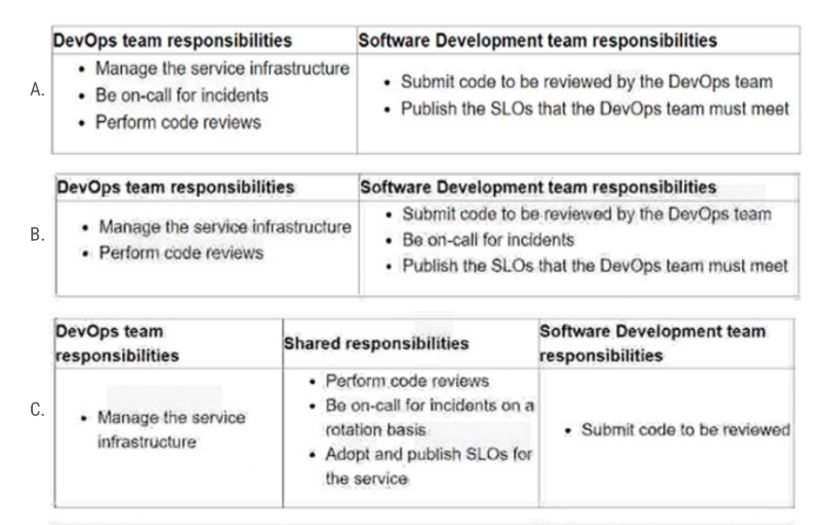

1. You support a Node.js application running on Google Kubernetes Engine (GKE) in production. The application makes several HTTP requests to
dependent applications. You want to anticipate which dependent applications might cause performance issues. What should you do?
   - A. Instrument all applications with Cloud Profiler.
   - B. Instrument all applications with Cloud Trace and review inter-service HTTP requests.
   - C. Use Cloud Debugger to review the execution of logic within each application to instrument all applications.
   - D. Modify the Node.js application to log HTTP request and response times to dependent applications. Use Cloud Logging to nd
   dependent applications that are performing poorly.

   **B**. Cloud Trace collects latency data from applications. You need to trace each component. Profiler is for monitoring utilization, such as CPU and memory

2. You created a Cloud monitoring chart for CPU utilization in a dashboard within your workspace project. You want to share the chart with your Site
Reliability Engineering (SRE) team only. You want to ensure you follow the principle of least privilege. What should you do?
   - A. Share the workspace Project ID with the SRE team. Assign the SRE team the Monitoring Viewer IAM role in the workspace project.
   - B. Share the workspace Project ID with the SRE team. Assign the SRE team the Dashboard Viewer IAM role in the workspace project.
   - C. Click `Share chart by URL` and provide the URL to the SRE team. Assign the SRE team the Monitoring Viewer IAM role in the
   workspace project.
   - D. Click `Share chart by URL` and provide the URL to the SRE team. Assign the SRE team the Dashboard Viewer IAM role in the
   workspace project.

   **C**. Considering you specifically want to share chart only, you should not grant access to entire project. So use `Share chart by URL` to give minimum access. Dashboard Viewer means "Monitoring Dashboard Configuration Viewer" role, it is a configuration role and do not have sufficient permission to see the actual Dashboard

3. Your organization wants to implement Site Reliability Engineering (SRE) culture and principles. Recently, a service that you support had a
limited outage. A manager on another team asks you to provide a formal explanation of what happened so they can action remediations.
What should you do?
   - A. Develop a postmortem that includes the root causes, resolution, lessons learned, and a prioritized list of action items. Share it with the
manager only.
   - B. Develop a postmortem that includes the root causes, resolution, lessons learned, and a prioritized list of action items. Share it on the
engineering organization's document portal.
   - C. Develop a postmortem that includes the root causes, resolution, lessons learned, the list of people responsible, and a list of action
items for each person. Share it with the manager only.
   - D. Develop a postmortem that includes the root causes, resolution, lessons learned, the list of people responsible, and a list of action
items for each person. Share it on the engineering organization's document portal.

    **B**. Postmortem should be **blameless** so do not include name. And should be shared widely

4. You have a set of applications running on a Google Kubernetes Engine (GKE) cluster, and you are using Kubernetes Engine
Monitoring. You are bringing a new containerized application required by your company into production. This application is written by a third
party and cannot be modied or reconfigured. The application writes its log information to /var/log/app_messages.log, and you want to send
these log entries to Cloud Logging. What should you do?
   - A. Use the default GKE Kubernetes Engine Monitoring agent configuration.
   - B. Deploy a Fluentd daemonset to GKE. Then create a customized input and output configuration to tail the log file in the application's
   pods and write to Cloud Logging.
   - C. Install Kubernetes on Google Compute Engine (GCE) and redeploy your applications. Then customize the built-in Cloud Logging
   conguration to tail the log le in the application's pods and write to Cloud Logging.
   - D. Write a script to tail the log le within the pod and write entries to standard output. Run the script as a sidecar container with the
   application's pod. configure a shared volume between the containers to allow the script to have read access to /var/log in the application
   container.

   **B**. GKE has default logging agent but do not have ability to tail log file. Install Fluentd daemonset to help customize log, which is suggest by google. https://cloud.google.com/kubernetes-engine/docs/concepts/about-logs#custom_agents

5. You are running an application in a virtual machine (VM) using a custom Debian image. The image has the Cloud Logging agent
installed. The VM has the cloud-platform scope. The application is logging information via syslog. You want to use Logging in the
Google Cloud Platform Console to visualize the logs. You notice that syslog is not showing up in the "All logs" dropdown list of the Logs
Viewer. What is the first thing you should do?

   - A. Look for the agent's test log entry in the Logs Viewer.
   - B. Install the most recent version of the Stackdriver agent.
   - C. Verify the VM service account access scope includes the monitoring.write scope.
   - D. SSH to the VM and execute the following commands on your VM: ps ax | grep uentd.

    **D**. GCP logging agent debug checklist suggest the first thing for debugging is to SSH into VM and verify if the logging agent is installed and running. https://cloud.google.com/logging/docs/agent/logging/troubleshooting#checklist For C, monitoring.write is incorrect because it is for cloud monitoring

6. You use a multiple step Cloud Build pipeline to build and deploy your application to Google Kubernetes Engine (GKE). You want to integrate
with a third-party monitoring platform by performing a HTTP POST of the build information to a webhook. You want to minimize the
development effort. What should you do?

   - A. Add logic to each Cloud Build step to HTTP POST the build information to a webhook.
   - B. Add a new step at the end of the pipeline in Cloud Build to HTTP POST the build information to a webhook.
   - C. Use Stackdriver Logging to create a logs-based metric from the Cloud Build logs. Create an Alert with a Webhook notication type.
   - D. Create a Cloud Pub/Sub push subscription to the Cloud Build cloud-builds PubSub topic to HTTP POST the build information to a
   webhook.

   **D**. Cloud build is a simple building tool and has no ability to do other thing like pushing notification etc. So to do this, use pub/sub to subscribe on cloud build, and then push HTTP POST to the web hook

7. You use Spinnaker to deploy your application and have created a canary deployment stage in the pipeline. Your application has an in-memory
cache that loads objects at start time. You want to automate the comparison of the canary version against the production version. How should
you configure the canary analysis?

   - A. Compare the canary with a new deployment of the current production version.
   - B. Compare the canary with a new deployment of the previous production version.
   - C. Compare the canary with the existing deployment of the current production version.
   - D. Compare the canary with the average performance of a sliding window of previous production versions
  
   **A**. Canary is a progressive rollout that split traffic between old and new. 

8. You support a high-trac web application and want to ensure that the home page loads in a timely manner. As a first step, you decide to
implement a Service Level Indicator (SLI) to represent home page request latency with an acceptable page load time set to 100 ms. What is the Google recommended way of calculating this SLI?

   - A. Bucketize the request latencies into ranges, and then compute the percentile at 100 ms.
   - B. Bucketize the request latencies into ranges, and then compute the median and 90th percentiles.
   - C. Count the number of home page requests that load in under 100 ms, and then divide by the total number of home page requests.
   - D. Count the number of home page request that load in under 100 ms, and then divide by the total number of all web application requests.

    **C**. SLO and SLI are both simple calculation of success/totl. the number of good events divided by the total number of events. And this is about the home page load SLO

9. You deploy a new release of an internal application during a weekend maintenance window when there is minimal user tragic. After the
window ends, you learn that one of the new features isn't working as expected in the production environment. After an extended outage, you
roll back the new release and deploy a fix.
You want to modify your release process to reduce the mean time to recovery so you can avoid extended outages in the future. What should
you do? (Choose two.)

   - A. Before merging new code, require 2 different peers to review the code changes.
   - B. Adopt the blue/green deployment strategy when releasing new code via a CD server.
   - C. Integrate a code linting tool to validate coding standards before any code is accepted into the repository.
   - D. Require developers to run automated integration tests on their local development environments before release.
   - E. configure a CI server. Add a suite of unit tests to your code and have your CI server run them on commit and verify any changes.

    **BE**. All are good practice but ACD are to minimize the number of outage and prevent the failure, not what you would do to reduce the time WHEN somethign goes wrong

10. You have a pool of application servers running on Compute Engine. You need to provide a secure solution that requires the least amount of
conguration and allows developers to easily access application logs for troubleshooting. How would you implement the solution on GCP?

    - A. Install the Cloud logging agent to the application servers. Give the developers the IAM Logs Viewer role to access
    cloud logging and view logs.
    - B. Install the Cloud logging agent to the application servers. Give the developers the IAM Logs Private Logs Viewer role to
    access cloud logging and view logs.
    - C. Install the Cloud monitoring agent to the application servers. Give the developers the IAM Monitoring Viewer role to
    access cloud logging and view metrics.
    - D. Install the gsutil command line tool on your application servers. Write a script using gsutil to upload your application log to a Cloud Storage bucket, and then schedule it to run via cron every 5 minutes.  Give the developers the IAM Object Viewer access to view the logs in the specied bucket.

    **A**. Install cloud logging agent give the ability to view GCE application logs in cloud logging. Then the IAM Logs Viewer grant permission to logs. Don't need Private logs viewer role as that is for Data Access log which is not for trouble shooting.

11. You support the backend of a mobile phone game that runs on a Google Kubernetes Engine (GKE) cluster. The application is serving HTTP
requests from users. You need to implement a solution that will reduce the network cost. What should you do?
    - A. configure the VPC as a Shared VPC Host project.
    - B. configure your network services on the Standard Tier.
    - C. configure your Kubernetes cluster as a Private Cluster.
    - D. configure a Google Cloud HTTP Load Balancer as Ingress.

     **B**. Using Standard Tier network service rather than Premium tier will DIRECTLY lower the cost. https://cloud.google.com/network-tiers/docs/overview. Standard Tier favor cost optimization where Premium tier optimize performance. While D could lower the cost by preventing overload resulting in higher performance machine, it is INDIRECT.

12. You encountered a major service outage that affected all users of the service for multiple hours. After several hours of incident management, the service returned to normal, and user access was restored. You need to provide an incident summary to relevant stakeholders following the Site Reliability Engineering recommended practices. What should you do first?
    - A. Call individual stakeholders to explain what happened.
    - B. Develop a post-mortem to be distributed to stakeholders.
    - C. Send the Incident State Document to all the stakeholders.
    - D. Require the engineer responsible to write an apology email to all stakeholders
  
    **B**. After incident is resolved, a blameless postmortem is suggested to the stakeholders

13. You are performing a semi-annual capacity planning exercise for your agship service. You expect a service user growth rate of 10% monthover-month over the next six months. Your service is fully containerized and runs on GCP, using a GKE Standard regional cluster on three zones with cluster autoscaler enabled. You currently consume about 30% of your total deployed CPU capacity, and you require resilience against the failure of a zone. You want to ensure that your users experience minimal negative impact as a result of this growth or as a result of zone failure, while avoiding unnecessary costs. What should you do?

    - A. Verify the maximum node pool size, enable a horizontal pod autoscaler, and then perform a load test to verify your expected resource
    needs.
    - B. Because you are deployed on GKE and are using a cluster autoscaler, your GKE cluster will scale automatically, regardless of growth
    rate.
    - C. Because you are at only 30% utilization, you have signicant headroom and you won't need to add any additional capacity for this rate
    of growth.
    - D. Proactively add 60% more node capacity to account for six months of 10% growth rate, and then perform a load test to make sure you
    have enough capacity.

    **A**. Bascially A means verify the autoscaler is configured properly. It is a good practice to verify the resources compared to projected use and test. Verification is crucial. Relying blindly on autoscaler is not recommended because: Autoscaler rely on accurate predictions. It primarily respond to unschedulable pods. 

14. Your application images are built and pushed to Google Artifact Registry (GAR). You want to build an automated pipeline that deploys the
application when the image is updated while minimizing the development effort. What should you do?

    - A. Use Cloud Build to trigger a Spinnaker pipeline.
    - B. Use Cloud Pub/Sub to trigger a Spinnaker pipeline.
    - C. Use a custom builder in Cloud Build to trigger Jenkins pipeline.
    - D. Use Cloud Pub/Sub to trigger a custom deployment service running in Google Kubernetes Engine (GKE)
  
    **B**. Both A and B works but B is preferred for flexibility and decoupling. With Pub/Sub, it subscribe to the artifact registry and push message to trigger spinnaker pipeline. For Cloud build, you have to define all the steps in `cloudbuild.yaml` and then use the Cloud build trigger on code update.

15. Your product is currently deployed in three Google Cloud Platform (GCP) zones with your users divided between the zones. You can fail over from one zone to another, but it causes a 10-minute service disruption for the affected users. You typically experience a database failure once per quarter and can detect it within five minutes. You are cataloging the reliability risks of a new real-time chat feature for your product. You catalog the following information for each risk: 
    * Mean Time to Detect (MTTD) in minutes
    * Mean Time to Repair (MTTR) in minutes
    * Mean Time Between Failure (MTBF) in days
    * User Impact Percentage
The chat feature requires a new database system that takes twice as long to successfully fail over between zones. You want to account for
the risk of the new database failing in one zone. What would be the values for the risk of database failover with the new system?

    - A. MTTD: 5 MTTR: 10 MTBF: 90 Impact: 33%
    - B. MTTD: 5 MTTR: 20 MTBF: 90 Impact: 33%
    - C. MTTD: 5 MTTR: 10 MTBF: 90 Impact: 50%
    - D. MTTD: 5 MTTR: 20 MTBF: 90 Impact: 50%

    **B**. 5 mins to detect. 10 min to failover between zone but it is not repaired until the new DB is up and system back to working, which is 20min. Once every quarter is 90 days interval. 1 out of 3 zone fail impact 33%.

16. You are managing the production deployment to a set of Google Kubernetes Engine (GKE) clusters. You want to make sure only images which
are successfully built by your trusted CI/CD pipeline are deployed to production. What should you do?

    - A. Enable Cloud Security Scanner on the clusters.
    - B. Enable Vulnerability Analysis on the Container Registry.
    - C. Set up the Kubernetes Engine clusters as private clusters.
    - D. Set up the Kubernetes Engine clusters with Binary Authorization.

    **D**. Binary Authorization is a tool to ensure only authorized built images get deployed on GCP containerized platform

17. You support an e-commerce application that runs on a large Google Kubernetes Engine (GKE) cluster deployed on-premises and on Google
Cloud Platform. The application consists of microservices that run in containers. You want to identify containers that are using the most CPU
and memory. What should you do?

    - A. Use Cloud Monitoring.
    - B. Use Prometheus to collect and aggregate logs per container, and then analyze the results in Grafana.
    - C. Use the Cloud Monitoring API to create custom metrics, and then organize your containers using groups.
    - D. Use Cloud Logging to export application logs to BigQuery, aggregate logs per container, and then analyze CPU and memory
    consumption.

    **A**. Cloud monitoring is the great way to monitor metrics (CPU and memory). For GCP GKE, it directly visual metrics. For GKE On-premise, it CAN read metrics but require configuration and agent to forward the metrics. B is good for monitoring but more suitable for custom mertics.

18. Your company experiences bugs, outages, and slowness in its production systems. Developers use the production environment for new feature development and bug fixes. Configuration and experiments are done in the production environment, causing outages for users. Testers use the production environment for load testing, which often slows the production systems. You need to redesign the environment to reduce the number of bugs and outages in production and to enable testers to load test new features. What should you do?

    - A. Create an automated testing script in production to detect failures as soon as they occur.
    - B. Create a development environment with smaller server capacity and give access only to developers and testers.
    - C. Secure the production environment to ensure that developers can't change it and set up one controlled update per year.
    - D. Create a development environment for writing code and a test environment for configurations, experiments, and load testing.

    **D**. Development, testing and production each should has its own environment

19. You support an application running on App Engine. The application is used globally and accessed from various device types. You want to know the number of connections. You are using Cloud Monitoring for App Engine. What metric should you use?
    - A. flex/connections/current
    - B. tcp_ssl_proxy/new_connections
    - C. tcp_ssl_proxy/open_connections
    - D. flex/instance/connections/current

    **A**. `flex/connections/current` is Number of current active connections per App Engine flexible environment version. B and C are for Cloud load balancing. D is the same metrics but for each instance instead of each version. The total number of connections is calculated across all instances of single version, that might include multiple instances. https://cloud.google.com/monitoring/api/metrics_gcp#gcp-appengine 

20. You support an application deployed on Compute Engine. The application connects to a Cloud SQL instance to store and retrieve data. After an update to the application, users report errors showing database timeout messages. The number of concurrent active users remained stable. You need to find the most probable cause of the database timeout. What should you do?
    - A. Check the serial port logs of the Compute Engine instance.
    - B. Use Cloud Profiler to visualize the resources utilization throughout the application.
    - C. Determine whether there is an increased number of connections to the Cloud SQL instance.
    - D. Use Cloud Security Scanner to see whether your Cloud SQL is under a Distributed Denial of Service (DDoS) attack

    **C**. Suggested by Gemini. DB timeout with same number of concurrent users after new app deployment suggest the new application code has increased query per users, or in proper connection management practice. This should be figure out first. With B cloud profiler, it mainly focus on application's internal performance, not its interaction with external service

21. Your application images are built using Cloud Build and pushed to Google Artifact Registry. You want to be able to specify a particular version of your application for deployment based on the release version tagged in source control. What should you do when you push the image?
    - A. Reference the image digest in the source control tag.
    - B. Supply the source control tag as a parameter within the image name.
    - C. Use Cloud Build to include the release version tag in the application image.
    - D. Use GCR digest versioning to match the image to the tag in source control.

    **C**. Use cloud build to include version $VAR in `cloudbuild.yml`. Then supply the actual number either in the trigger or via command line. 

22. You are on-call for an infrastructure service that has a large number of dependent systems. You receive an alert indicating that the service is failing to serve most of its requests and all of its dependent systems with hundreds of thousands of users are affected. As part of your Site Reliability Engineering (SRE) incident management protocol, you declare yourself Incident Commander (IC) and pull in two experienced people from your team as Operations Lead (OL) and Communications Lead (CL). What should you do next?

- A. Look for ways to mitigate user impact and deploy the mitigations to production.
- B. Contact the affected service owners and update them on the status of the incident.
- C. Establish a communication channel where incident responders and leads can communicate with each other.
- D. Start a postmortem, add incident information, circulate the draft internally, and ask internal stakeholders for input

**C**. Ensure effective communication is the first step in case of incident. https://sre.google/workbook/incident-response/

23. You are developing a strategy for monitoring your Google Cloud Platform (GCP) projects in production using Cloud Operations suite. One of the requirements is to be able to quickly identify and react to production environment issues without false alerts from development and staging projects. You want to ensure that you adhere to the principle of least privilege when providing relevant team members with access to Cloud Operations suite. What should you do?

    - A. Grant relevant team members read access to all GCP production projects. Create Cloud monitoring inside each project.
    - B. Grant relevant team members the Project Viewer IAM role on all GCP production projects. Create Cloud monitoring inside each
    project.
    - C. Choose an existing GCP production project to host the monitoring workspace. Attach the production projects to this workspace. Grant
    relevant team members read access to the Cloud monitoring.
    - D. Create a new GCP monitoring project and create a Cloud monitoring inside it. Attach the production projects to this workspace.
    Grant relevant team members read access to the Cloud monitoring.

    **D**. The concept of a *Monitoring Project* works here. A GCP project that is specifically for monitoring. You can attach other project to this monitoring project and grant access to people that is responsible for monitoring ONLY

24. You currently store the virtual machine (VM) utilization logs in Stackdriver. You need to provide an easy-to-share interactive VM utilization dashboard that is updated in real time and contains information aggregated on a quarterly basis. You want to use Google Cloud Platform solutions. What should you do?
    
    - A. Export VM utilization logs to BigQuery. Create a dashboard in Data Studio. Share the dashboard with your stakeholders.
    - B. Export VM utilization logs to Cloud Pub/Sub. From Cloud Pub/Sub, send the logs to a Security Information and Event Management (SIEM) system. Build the dashboards in the SIEM system and share with your stakeholders.
    - C. Export VM utilization logs to BigQuery. From BigQuery, export the logs to a CSV file. Import the CSV le into Google Sheets. Build a dashboard in Google Sheets and share it with your stakeholders.
    - D. Export VM utilization logs to a Cloud Storage bucket. Enable the Cloud Storage API to pull the logs programmatically. Build a custom data visualization application. Display the pulled logs in a custom dashboard.
  
    **A**. Data Studio is created to help visualize data. And you can create a logging sink to BigQuery. This is the most easy way. Other non google way, or involving non-native data format like CSV for google sheet is not efficient

25. You need to run a business-critical workload on a fixed set of Compute Engine instances for several months. The workload is stable with the exact amount of resources allocated to it. You want to lower the costs for this workload without any performance implications. What should you do?
    - A. Purchase Committed Use Discounts.
    - B. Migrate the instances to a Managed Instance Group.
    - C. Convert the instances to preemptible virtual machines.
    - D. Create an Unmanaged Instance Group for the instances used to run the workload.

    **A**. The resources required is consistant and predictable. Commited Use Discount give a large portion of discount when committing for a period of time

26. You are part of an organization that follows SRE practices and principles. You are taking over the management of a new service from the Development Team, and you conduct a Production Readiness Review (PRR). After the PRR analysis phase, you determine that the service cannot currently meet its Service Level Objectives (SLOs). You want to ensure that the service can meet its SLOs in production. What should you do next?
    - A. Adjust the SLO targets to be achievable by the service so you can bring it into production.
    - B. Notify the development team that they will have to provide production support for the service.
    - C. Identify recommended reliability improvements to the service to be completed before handover.
    - D. Bring the service into production with no SLOs and build them when you have collected operational data.

    **C**. A is hiding the problem. B will not increase SLOs, only maybe fix the problem quicker. D SLO is required. 

27. You are running an experiment to see whether your users like a new feature of a web application. Shortly after deploying the feature as a canary release, you receive a spike in the number of 500 errors sent to users, and your monitoring reports show increased latency. You want to quickly minimize the negative impact on users. What should you do first?
    - A. Roll back the experimental canary release.
    - B. Start monitoring latency, trac, errors, and saturation.
    - C. Record data for the postmortem document of the incident.
    - D. Trace the origin of 500 errors and the root cause of increased latency.

    **A**. To minimize the impact on users, you want to get the system back to normal ASAP. A is the first steps. B,C,D are all steps to debug after.

28. You are responsible for creating and modifying the Terraform templates that define your Infrastructure. Because two new engineers will also be working on the same code, you need to define a process and adopt a tool that will prevent you from overwriting each other's code. You also want to ensure that you capture all updates in the latest version. What should you do?
    - A. Store your code in a Git-based version control system. Establish a process that allows developers to merge their own changes at the end of each day.  Package and upload code to a versioned Cloud Storage basket as the latest master version.
    - B. Store your code in a Git-based version control system.  Establish a process that includes code reviews by peers and unit testing to ensure integrity and functionality before integration of code.  Establish a process where the fully integrated code in the repository becomes the latest master version.
    - C. Store your code as text les in Google Drive in a dened folder structure that organizes the les.  At the end of each day, confirm that all changes have been captured in the les within the folder structure.  Rename the folder structure with a predened naming convention that increments the version.
    - D. Store your code as text les in Google Drive in a dened folder structure that organizes the les.  At the end of each day, confirm that all changes have been captured in the les within the folder structure and create a new .zip archive with a predened naming convention.  Upload the .zip archive to a versioned Cloud Storage bucket and accept it as the latest version.

    **B**. Multiple developers work on the same code base. follow standard git practice

29. You support a high-traffic web application with a microservice architecture. The home page of the application displays multiple widgets containing content such as the current weather, stock prices, and news headlines. The main serving thread makes a call to a dedicated microservice for each widget and then lays out the homepage for the user. The microservices occasionally fail; when that happens, the serving thread serves the homepage with some missing content. Users of the application are unhappy if this degraded mode occurs too frequently, but they would rather have some content served instead of no content at all. You want to set a Service Level Objective (SLO) to ensure that the user experience does not degrade too much. What Service Level Indicator (SLI) should you use to measure this?
    - A. A quality SLI: the ratio of non-degraded responses to total responses.
    - B. An availability SLI: the ratio of healthy microservices to the total number of microservices.
    - C. A freshness SLI: the proportion of widgets that have been updated within the last 10 minutes.
    - D. A latency SLI: the ratio of microservice calls that complete in under 100 ms to the total number of microservice calls.

    **A**. User's expectation is to see some contents. The SLI here should reflect the quality of the service, rather then the availability. 

30. You support a multi-region web service running on Google Kubernetes Engine (GKE) behind a Global HTTP/S Cloud Load Balancer (CLB). For legacy reasons, user requests first go through a third-party Content Delivery Network (CDN), which then routes trac to the CLB. You have already implemented an availability Service Level Indicator (SLI) at the CLB level. However, you want to increase coverage in case of a potential load balancer misconguration, CDN failure, or other global networking catastrophe. Where should you measure this new SLI? (Choose two.)
    - A. Your application servers' logs.
    - B. Instrumentation coded directly in the client.
    - C. Metrics exported from the application servers.
    - D. GKE health checks for your application servers.
    - E. A synthetic client that periodically sends simulated user requests.

31. Your team is designing a new application for deployment into Google Kubernetes Engine (GKE). You need to set up monitoring to collect and aggregate various application-level metrics in a centralized location. You want to use Google Cloud Platform services while minimizing the amount of work required to set up monitoring. What should you do?
    - A. Publish various metrics from the application directly to the Cloud Monitoring API, and then observe these custom metrics in Cloud monitoring.
    - B. Install the Cloud Pub/Sub client libraries, push various metrics from the application to various topics, and then observe the aggregated metrics in Cloud monitoring.
    - C. Install the OpenTelemetry client libraries in the application, configure Cloud monitoring as the export destination for the metrics, and then observe the application's metrics in Cloud monitoring.
    - D. Emit all metrics in the form of application-specic log messages, pass these messages from the containers to the Cloud logging collector, and then observe metrics in Cloud monitoring.

    **C**. As per https://cloud.google.com/monitoring/custom-metrics, Using OpenTelemetry is recommended. "You can create user-defined metrics, except log-based metrics, by using the Cloud Monitoring API directly. However, we recommend that you use OpenTelemetry. ". Because publish metrics to cloud monitoring API and then observe requires lofs of configuration. OpenTelemetry, a widely adopted and robust open-source framework designed specifically for collecting and exporting telemetry data

32. You support a production service that runs on a single Compute Engine instance. You regularly need to spend time on recreating the service by deleting the crashing instance and creating a new instance based on the relevant image. You want to reduce the time spent performing manual operations while following Site Reliability Engineering principles. What should you do?

    - A. File a bug with the development team so they can nd the root cause of the crashing instance.
    - B. Create a Managed instance Group with a single instance and use health checks to determine the system status.
    - C. Add a Load Balancer in front of the Compute Engine instance and use health checks to determine the system status.
    - D. Create a Monitoring dashboard with SMS alerts to be able to start recreating the crashed instance promptly after it was crashed.

    **B**. Managed Instance Group provide auto repairs and autohealing to handle failed instance by recreating them. https://cloud.google.com/compute/docs/instance-groups?hl=en#autohealing

33. Your application artifacts are being built and deployed via a CI/CD pipeline. You want the CI/CD pipeline to securely access application
secrets. You also want to more easily rotate secrets in case of a security breach. What should you do?

    - A. Prompt developers for secrets at build time. Instruct developers to not store secrets at rest.
    - B. Store secrets in a separate configuration le on Git. Provide select developers with access to the conguration le.
    - C. Store secrets in Cloud Storage encrypted with a key from Cloud KMS. Provide the CI/CD pipeline with access to Cloud KMS via IAM.
    - D. Encrypt the secrets and store them in the source code repository. Store a decryption key in a separate repository and grant your pipeline access to it.

    **C**. To store secrets and keys, always used Google Cloud KMS encryption. KMS (Cloud Key Management Service) generate, manage and control cryptographic keys used in encryption. It does not store keys though

34. Your company follows Site Reliability Engineering practices. You are the person in charge of Communications for a large, ongoing incident affecting your customer-facing applications. There is still no estimated time for a resolution of the outage. You are receiving emails from internal stakeholders who want updates on the outage, as well as emails from customers who want to know what is happening. You want to efficiently provide updates to everyone affected by the outage. What should you do?
    - A. Focus on responding to internal stakeholders at least every 30 minutes. Commit to ג€next updateג€ times.
    - B. Provide periodic updates to all stakeholders in a timely manner. Commit to a ג€next updateג€ time in all communications.
    - C. Delegate the responding to internal stakeholder emails to another member of the Incident Response Team. Focus on providing responses directly to customers.
    - D. Provide all internal stakeholder emails to the Incident Commander, and allow them to manage internal communications. Focus on providing responses directly to customers

    **B**. "person in charge of Communications" means you are Communication Lead (CL). "The CL’s main duties include providing periodic updates to the incident response team and stakeholders, and managing inquiries about the incident.". https://sre.google/workbook/incident-response/. The main roles in the incident are `Incident Commander(IC)`, `Communications Lead(CL)` and `Operation Lead (OL)`

35. Your team uses Cloud Build for all CI/CD pipelines. You want to use the kubectl builder for Cloud Build to deploy new images to Google Kubernetes Engine (GKE). You need to authenticate to GKE while minimizing development effort. What should you do?
    - A. Assign the Container Developer role to the Cloud Build service account.
    - B. Specify the Container Developer role for Cloud Build in the cloudbuild.yaml file.
    - C. Create a new service account with the Container Developer role and use it to run Cloud Build.
    - D. Create a separate step in Cloud Build to retrieve service account credentials and pass these to kubectl.

    **A**. By Default the `roles/container.developer` is Disabled. This role is required to deploy to GKE. This role can be granted in IAM Roles and permission, or simply in the Cloud Build Setting pages. Cloud Build Service account is primarily for Cloud Build so no need to create a new SA

36. You support an application that stores product information in cached memory. For every cache miss, an entry is logged in Cloud Logging. You want to visualize how often a cache miss happens over time. What should you do?
    - A. Link Cloud Logging as a source in Google Data Studio. Fifilter the logs on the cache misses.
    - B. Configure Cloud Profiler to identify and visualize when the cache misses occur based on the logs.
    - C. Create a logs-based metric in Cloud Logging and a dashboard for that metric in Cloud Monitoring.
    - D. Configure BigQuery as a sink for Cloud Logging. Create a scheduled query to filter the cache miss logs and write them to a separate table.

    **C**. Logs-based metrics provides ability to extract metrics from log, (Count or Distribution) and then Cloud Monitoring can visual it via a dashboard. A and D are unnecessary, B - Profiler is for performance.

37. You need to deploy a new service to production. The service needs to automatically scale using a Managed Instance Group (MIG) and should be deployed over multiple regions. The service needs a large number of resources for each instance and you need to plan for capacity. What should you do?
    - A. Use the n1-highcpu-96 machine type in the conguration of the MIG.
    - B. Monitor results of Cloud Trace to determine the required amount of resources.
    - C. Validate that the resource requirements are within the available quota limits of each region.
    - D. Deploy the service in one region and use a global load balancer to route trac to this region.

    **C**. This is mandatory because exceeding those limits will prevent the deployment. https://cloud.google.com/compute/resource-usage. Compute Engine enforces allocation quotas on resource usage. If you expect a notable upcoming increase in useage, you can proactively request quota adjustments. A would work but `n1-highcpu-96` is too specific

38. You are running an application on Compute Engine and collecting logs through Cloud Logging. You discover that some personally identiable information (PII) is leaking into certain log entry elds. All PII entries begin with the text userinfo. You want to capture these log entries in a secure location for later review and prevent them from leaking to Cloud Logging. What should you do?
    - A. Create a basic log filter matching userinfo, and then configure a log export in the Cloud logging console with Cloud Storage as a sink.
    - B. Use a Fluentd filter plugin with the Cloud Logging Agent to remove log entries containing userinfo, and then copy the entries to a Cloud Storage bucket.
    - C. Create an advanced log filter matching userinfo, configure a log export in the Cloud Logging console with Cloud Storage as a sink, and then configure a log exclusion with userinfo as a filter.
    - D. Use a Fluentd filter plugin with the Cloud Logging Agent to remove log entries containing userinfo, create an advanced log filter matching userinfo, and then configure a log export in the Cloud logging console with Cloud Storage as a sink.

    **B**. First use fifilters to remove userinfo, prevent leaking to cloud logging. Then export to Cloud Storage as sink. A is wrong because it does no prevention. C only prevent leaking to public but still leak to cloud storage. D unnecessary advanced log fifilter because it has been removed by Fluentd

39. You have a CI/CD pipeline that uses Cloud Build to build new Docker images and push them to Docker Hub. You use Git for code versioning. After making a change in the Cloud Build YAML conguration, you notice that no new artifacts are being built by the pipeline. You need to resolve the issue following Site Reliability Engineering practices. What should you do?
    - A. Disable the CI pipeline and revert to manually building and pushing the artifacts.
    - B. Change the CI pipeline to push the artifacts is Container Registry instead of Docker Hub.
    - C. Upload the conguration YAML le to Cloud Storage and use Error Reporting to identify and fix the issue.
    - D. Run a Git compare between the previous and current Cloud Build Configuration files.

    **D**. Cloud Build setup was not changed. Code changed is likley affect `cloudbuild.yaml` which is responsible to instruct cloud build

40. Your company follows Site Reliability Engineering principles. You are writing a postmortem for an incident, triggered by a software change, that severely affected users. You want to prevent severe incidents from happening in the future. What should you do?
    - A. Identify engineers responsible for the incident and escalate to their senior management.
    - B. Ensure that test cases that catch errors of this type are run successfully before new software releases.
    - C. Follow up with the employees who reviewed the changes and prescribe practices they should follow in the future.
    - D. Design a policy that will require on-call teams to immediately call engineers and management to discuss a plan of action if an incident
    occurs.

    **B**. The incident is due to a software change. Implement tests procedure before release can reduce the chance of this happening. A and D will not help prevent this. C, this is not necessary preventable by reviewing only.

41. You support a high-trac web application that runs on Google Cloud Platform (GCP). You need to measure application reliability from a user perspective without making any engineering changes to it. What should you do? (Choose two.)
    - A. Review current application metrics and add new ones as needed.
    - B. Modify the code to capture additional information for user interaction.
    - C. Analyze the web proxy logs only and capture response time of each request.
    - D. Create new synthetic clients to simulate a user journey using the application.
    - E. Use current and historic Request Logs to trace customer interaction with the application.

    **DE**. "From user persepctive" - A synthetic clients to simulate. "Use current logs to trace customer interaction" is the measure from user persepctive.  Others: A, B require code3 change. C too limited.

42. You manage an application that is writing logs to Cloud Logging. You need to give some team members the ability to export logs. What should you do?
    - A. Grant the team members the IAM role of logging.configWriter on Cloud IAM.
    - B. Configure Access Context Manager to allow only these members to export logs.
    - C. Create and grant a custom IAM role with the permissions logging.sinks.list and logging.sink.get.
    - D. Create an Organizational Policy in Cloud IAM to allow only these members to create log exports.

    **A**. As per https://cloud.google.com/logging/docs/access-control#logging.configWriter, `logging.configWriter` allow read and write to sink for exporting logs. More specifict, `logging.sink.create` is needed

43. Your application services run in Google Kubernetes Engine (GKE). You want to make sure that only images from your centrally-managed Google Artifact Registry image registry in the altostrat-images project can be deployed to the cluster while minimizing development time. What should you do?
    - A. Create a custom builder for Cloud Build that will only push images to gcr.io/altostrat-images.
    - B. Use a Binary Authorization policy that includes the whitelist name pattern gcr.io/altostrat-images/.
    - C. Add logic to the deployment pipeline to check that all manifests contain only images from gcr.io/altostrat-images.
    - D. Add a tag to each image in gcr.io/altostrat-images and check that this tag is present when the image is deployed.

    **B**. Binary Authorization allows you to control what source of image can be deployed to GKE. Here you want to whitelist gcr.io/[project name]

44. Your team has recently deployed an NGINX-based application into Google Kubernetes Engine (GKE) and has exposed it to the public via an HTTP Google Cloud Load Balancer (GCLB) ingress. You want to scale the deployment of the application's frontend using an appropriate Service Level Indicator (SLI). What should you do?
    - A. Configure the horizontal pod autoscaler to use the average response time from the Liveness and Readiness probes.
    - B. Configure the vertical pod autoscaler in GKE and enable the cluster autoscaler to scale the cluster as pods expand.
    - C. Install the Cloud Monitoring custom metrics adapter and Configure a horizontal pod autoscaler to use the number of requests provided by the GCLB.
    - D. Expose the NGINX stats endpoint and Configure the horizontal pod autoscaler to use the request metrics exposed by the NGINX deployment.

    **C**. Metric adapter allows GKE autoscaler to read metric from load balancer and scale accordingly. This should be Horizontal Scale because it adds new pods. B is wrong because vertical scaling will expand the singe machine power. A is wrong because Liveness and Readiness only measure if resource is up and running.

45. Your company follows Site Reliability Engineering practices. You are the Incident Commander for a new, customer-impacting incident. You need to immediately assign two incident management roles to assist you in an effective incident response. What roles should you assign? (Choose two.)
    - A. Operations Lead
    - B. Engineering Lead
    - C. Communications Lead
    - D. Customer Impact Assessor
    - E. External Customer Communications Lead

    **AC**. Three roles in SRE incidents are Command Leader, Operation Leader, Communication Leader

46. You support an application running on GCP and want to configureSMS notications to your team for the most critical alerts in CloudMonitoring. You have already identify the alerting policies you want to configure this for. What should you do?
    - A. Download and configure third-party integration between Cloud Monitoring and an SMS gateway. Ensure that your team members add their SMS/phone numbers to the external tool.
    - B. Select the Webhook notications option for each alerting policy, and configureit to use a third-party integration tool. Ensure that your team members add their SMS/phone numbers to the external tool.
    - C. Ensure that your team members set their SMS/phone numbers in their Cloud Profile. Select the SMS notication option for each alerting policy and then select the appropriate SMS/phone numbers from the list.
    - D. configure Slack notication for each alerting policy. Set up a Slack-to-SMS integration to send SMS messages when Slack messages are received. Ensure that your team members add their SMS/phone numbers to the external integration.

    **C**. Under Cloud Monitoring -> Alerting Policy -> Notification channel, you can directly send SMS message. This is the easiest way. You can also have Email, Slack, Google Chat, Pub/Sub, etc

47. You are managing an application that exposes an HTTP endpoint without using a load balancer. The latency of the HTTP responses is important for the user experience. You want to understand what HTTP latencies all of your users are experiencing. You use cLOUD Monitoring. What should you do?
    - A. In your application, create a metric with a metricKind set to DELTA and a valueType set to DOUBLE. In Metrics Explorer, use a Stacked Bar graph to visualize the metric.
    - B. In your application, create a metric with a metricKind set to CUMULATIVE and a valueType set to DOUBLE. In Metrics Explorer, use a Line graph to visualize the metric.
    - C. In your application, create a metric with a metricKind set to GAUGE and a valueType set to DISTRIBUTION. In Metrics Explorer, use a Heatmap graph to visualize the metric.
    - D. In your application, create a metric with a metricKind set to METRIC_KIND_UNSPECIFIED and a valueType set to INT64. In Metrics Explorer, use a Stacked Area graph to visualize the metric.

    **C**. There are two types of `metric kind`: GAUGE (instant) and DELTA (interval). Four type of `value type`: BOOL, INT64, DOUBLE, STRING. For summary of a group of values, use DISTRIBUTION. Here for latency, it is a instant event, and we want to see the distribution of the values

48. Your team is designing a new application for deployment both inside and outside Google Cloud Platform (GCP). You need to collect detailed metrics such as system resource utilization. You want to use centralized GCP services while minimizing the amount of work required to set up this collection system. What should you do?
    - A. Import the Cloud Profiler package, and configureit to relay function timing data for further analysis.
    - B. Import the Cloud Debugger package, and configurethe application to emit debug messages with timing information.
    - C. Instrument the code using a timing library, and publish the metrics via a health check endpoint that is scraped by Stackdriver.
    - D. Install an Application Performance Monitoring (APM) tool in both locations, and configuren export to a central data storage location for analysis.

    **A**. For resource utilization and performance, google provide Cloud Profiler. Cloud Profile works both inside and outside of GCP. See https://cloud.google.com/profiler/docs/about-profiler#environment_and_languages

49. You need to reduce the cost of virtual machines (VM) for your organization. After reviewing different options, you decide to leverage preemptible VM instances. Which application is suitable for preemptible VMs?
    - A. A scalable in-memory caching system.
    - B. The organization's public-facing website.
    - C. A distributed, eventually consistent NoSQL database cluster with sucient quorum.
    - D. A GPU-accelerated video rendering platform that retrieves and stores videos in a storage bucket.

    **D**. preemptible VMs is used for false tolerate workload. With D video rendering, the data is stored in storage bucket which will not lost if VM is preempted. Rendering job can be picked up by another VM if the preemptible vm is terminated. Also preemptible VM can have GPU. https://cloud.google.com/compute/docs/instances/preemptible#preemptible-with-gpu

50. Your organization recently adopted a container-based workow for application development. Your team develops numerous applications that are deployed continuously through an automated build pipeline to a Kubernetes cluster in the production environment. The security auditor is concerned that developers or operators could circumvent automated testing and push code changes to production without approval. What should you do to enforce approvals?
    - A. Configure the build system with protected branches that require pull request approval.
    - B. Use an Admission Controller to verify that incoming requests originate from approved sources.
    - C. Leverage Kubernetes Role-Based Access Control (RBAC) to restrict access to only approved users.
    - D. Enable binary authorization inside the Kubernetes cluster and configure the build pipeline as an attestor.

    **D**. The key is "continuously through an automated build pipeline". To ensure ONLY pipeline built image can be deployed, use binary authorization. A is a correct practice, but it does not adhere to the requirement here of "pipeline only" because you can run GKE command to directly push image rather than using pipeline.

51. You support a stateless web-based API that is deployed on a single Compute Engine instance in the europe-west2-a zone. The Service Level Indicator (SLI) for service availability is below the specied Service Level Objective (SLO). A postmortem has revealed that requests to the API regularly time out. The time outs are due to the API having a high number of requests and running out memory. You want to improve service availability. What should you do?
    - A. Change the specied SLO to match the measured SLI
    - B. Move the service to higher-specication compute instances with more memory
    - C. Set up additional service instances in other zones and load balance the trac between all instances
    - D. Set up additional service instances in other zones and use them as a failover in case the primary instance is unavailable

    **C**. To increase the service availability usually scale horizontally. Adding new instance and use load balancing will distributed the workload, providing redundancy. Scale vertically by adding power to the machine is usually not recommend for availability increase.

52. You are running a real-time gaming application on Compute Engine that has a production and testing environment. Each environment has their own Virtual Private Cloud (VPC) network. The application frontend and backend servers are located on different subnets in the environment's VPC. You suspect there is a malicious process communicating intermittently in your production frontend servers. You want to ensure that network trac is captured for analysis. What should you do?
    - A. Enable VPC Flow Logs on the production VPC network frontend and backend subnets only with a sample volume scale of 0.5.
    - B. Enable VPC Flow Logs on the production VPC network frontend and backend subnets only with a sample volume scale of 1.0.
    - C. Enable VPC Flow Logs on the testing and production VPC network frontend and backend subnets with a volume scale of 0.5. Apply changes in testing before production.
    - D. Enable VPC Flow Logs on the testing and production VPC network frontend and backend subnets with a volume scale of 1.0. Apply changes in testing before production.

    **B**. Because suspious traffic is on production enviornment, only need to enable VPC Flow logs on production. sample volumne scale of 0.5 means 50% of the traffic being capture. This is NOT adequate for security and safety analysis so only B is correct.

53. Your team of Infrastructure DevOps Engineers is growing, and you are starting to use Terraform to manage infrastructure. You need a way to implement code versioning and to share code with other team members. What should you do?
    - A. Store the Terraform code in a version-control system. Establish procedures for pushing new versions and merging with the master.
    - B. Store the Terraform code in a network shared folder with child folders for each version release. Ensure that everyone works on different files.
    - C. Store the Terraform code in a Cloud Storage bucket using object versioning. Give access to the bucket to every team member so they can download the les.
    - D. Store the Terraform code in a shared Google Drive folder so it syncs automatically to every team member's computer. Organize les with a naming convention that identies each new version.

    **A**. Using version control system like Git is the standard practice for code collaboration. Including IaaC.

54. You are using Cloud monitoring to monitor applications hosted on Google Cloud Platform (GCP). You recently deployed a new application, but its logs are not appearing on the Cloud monitoring dashboard. You need to troubleshoot the issue. What should you do?
    - A. Confirm that the Cloud monitoring/Ops agent has been installed in the hosting virtual machine.
    - B. Confirm that your account has the proper permissions to use the cloud monitoring dashboard.
    - C. Confirm that port 25 has been opened in the rewall to allow messages through to Cloud monitoring.
    - D. Confirm that the application is using the required client library and the service account key has proper permissions.

    **A**. Similar to Cloud Logging, the first step to debug why monitoring not appears is to verify it has been properly installed. https://cloud.google.com/stackdriver/docs/solutions/agents/ops-agent/troubleshoot-install-startup. A new appliaction/new VM may not have agent installed. Not B becasue if no permission for dashboard, you will not SEE the dasboard page.

55. Your organization recently adopted a container-based workow for application development. Your team develops numerous applications that are deployed continuously through an automated build pipeline to the production environment. A recent security audit alerted your team that the code pushed to production could contain vulnerabilities and that the existing tooling around virtual machine (VM) vulnerabilities no longer applies to the containerized environment. You need to ensure the security and patch level of all code running through the pipeline. What hould you do?
    - A. Set up Container Analysis to scan and report Common Vulnerabilities and Exposures.
    - B. configurethe containers in the build pipeline to always update themselves before release.
    - C. Reconfigurethe existing operating system vulnerability software to exist inside the container.
    - D. Implement static code analysis tooling against the Docker les used to create the containers.

    **A**. To scan for vulnerabilities you use GCP Artifact analysis and vulnerability scanning. https://cloud.google.com/artifact-registry/docs/analysis

56. You use Cloud Build to build your application. You want to reduce the build time while minimizing cost and development effort. What should you do?
    - A. Use Cloud Storage to cache intermediate artifacts.
    - B. Run multiple Jenkins agents to parallelize the build.
    - C. Use multiple smaller build steps to minimize execution time.
    - D. Use larger Cloud Build virtual machines (VMs) by using the machine-type option.

    **A**. To increase the build speed, reuse the result from a previous build by caching it on GCP cloud storage. https://cloud.google.com/build/docs/optimize-builds/speeding-up-builds#caching_directories_with_google_cloud_storage

57. ou support a web application that is hosted on Compute Engine. The application provides a booking service for thousands of users. Shortly after the release of a new feature, your monitoring dashboard shows that all users are experiencing latency at login. You want to mitigate the impact of the incident on the users of your service. What should you do first?
    - A. Roll back the recent release.
    - B. Review the Stackdriver monitoring.
    - C. Upsize the virtual machines running the login services.
    - D. Deploy a new release to see whether it fixes the problem.

    **A**. Any issue after a release, to mitigate the impact on user, first thing is to roll back the release.

58. You are deploying an application that needs to access sensitive information. You need to ensure that this information is encrypted and the risk of exposure is minimal if a breach occurs. What should you do?
    - A. Store the encryption keys in Cloud Key Management Service (KMS) and rotate the keys frequently
    - B. Inject the secret at the time of instance creation via an encrypted conguration management system.
    - C. Integrate the application with a Single sign-on (SSO) system and do not expose secrets to the application.
    - D. Leverage a continuous build pipeline that produces multiple versions of the secret for each instance of the application.

    **A**. Any type of encryption on GCP. The best practice is to use KMS for encryption keys and rotate frequently.

59. You encounter a large number of outages in the production systems you support. You receive alerts for all the outages that wake you up at night. The alerts are due to unhealthy systems that are automatically restarted within a minute. You want to set up a process that would prevent staff burnout while following Site Reliability Engineering practices. What should you do?
    - A. Eliminate unactionable alerts.
    - B. Create an incident report for each of the alerts.
    - C. Distribute the alerts to engineers in different time zones.
    - D. Redene the related Service Level Objective so that the error budget is not exhausted.

    **A**. This failure were automatically restarted timely and do not cause any acutal user/system concern. Therefore this is unactionable alert. https://cloud.google.com/blog/products/management-tools/meeting-reliability-challenges-with-sre-principles SRE principle to eliminate bad monitoring and only have alerts on actionable problem

60. You have migrated an e-commerce application to Google Cloud Platform (GCP). You want to prepare the application for the upcoming busy season. What should you do first to prepare for the busy season?
    - A. Load test the application to prole its performance for scaling.
    - B. Enable AutoScaling on the production clusters, in case there is growth.
    - C. Pre-provision double the compute power used last season, expecting growth.
    - D. Create a runbook on inating the disaster recovery (DR) environment if there is growth.

    **A**. Any projected capacity increase is subjected to a load test first. Any scaling or autoscaling is the NEXT step after the proper test has been completed. https://www.googlecloudcommunity.com/gc/Community-Blogs/Cloud-event-management-Best-practices-to-prepare-for-peak-season/ba-p/495066#toc-hId-704440157

61. You support a web application that runs on App Engine and uses CloudSQL and Cloud Storage for data storage. After a short spike in website traffic, you notice a big increase in latency for all user requests, increase in CPU use, and the number of processes running the application. Initial troubleshooting reveals:
✑ After the initial spike in trac, load levels returned to normal but users still experience high latency.
✑ Requests for content from the CloudSQL database and images from Cloud Storage show the same high latency.
✑ No changes were made to the website around the time the latency increased.
✑ There is no increase in the number of errors to the users.
You expect another spike in website trac in the coming days and want to make sure users don't experience latency. What should you do
    - A. Upgrade the GCS buckets to Multi-Regional.
    - B. Enable high availability on the CloudSQL instances.
    - C. Move the application from App Engine to Compute Engine.
    - D. Modify the App Engine conguration to have additional idle instances.

    **D**. There is no code change means the system does not have any functional issue due to recent release. No increase in number of errors means system is stable. Both cloud SQL and Cloud Storage shows high latency means the slowdown is neigher cloud SQL or cloud storage. Therefore the latency is likely coming from not have enough instance, it is a load balancing issue. Increase the `max_idle_instances` will solve this. 

62. Your application runs on Google Cloud Platform (GCP). You need to implement Jenkins for deploying application releases to GCP. You want to streamline the release process, lower operational toil, and keep user data secure. What should you do?
    - A. Implement Jenkins on local workstations.
    - B. Implement Jenkins on Kubernetes on-premises.
    - C. Implement Jenkins on Google Cloud Functions.
    - D. Implement Jenkins on Compute Engine virtual machines

    **D**. Using GCE allows you to leverage security and compliance features, keep data secure and easy maintenance via Market Place GCE Jenkins

63. You are working with a government agency that requires you to archive application logs for seven years. You need to configure cloud logging to export and store the logs while minimizing costs of storage. What should you do?

    - A. Create a Cloud Storage bucket and develop your application to send logs directly to the bucket.
    - B. Develop an App Engine application that pulls the logs from cloud logging and saves them in BigQuery.
    - C. Create an export in cloud logging and configure Cloud Pub/Sub to store logs in permanent storage for seven years.
    - D. Create a sink in cloud logging, name it, create a bucket on Cloud Storage for storing archived logs, and then select the bucket as the log export destination.

    **D**. To export logs from cloud logging, create sink in cloud logging. To archive and stored, use Cloud storage with coldline. If for analysis, set BigQuery as sink instead

64. You support a trading application written in Python and hosted on App Engine exible environment. You want to customize the error information being sent to Cloud Error Reporting. What should you do?

    - A. Install the Cloud Error Reporting library for Python, and then run your code on a Compute Engine VM.
    - B. Install the Cloud Error Reporting library for Python, and then run your code on Google Kubernetes Engine.
    - C. Install the Cloud Error Reporting library for Python, and then run your code on App Engine exible environment.
    - D. Use the Cloud Error Reporting API to write errors from your application to ReportedErrorEvent, and then generate log entries with properly formatted error messages in Cloud Logging.

    **D**. To use cloud error reporting, normally you will need ot install library specifically for python. However, with App Engine Flex environment, permission is already granted and no need to install error reporting libraries for python. https://cloud.google.com/error-reporting/docs/setup/python#app-engine. So all you need to do is to use the API and configure the output properly.

65. You need to define Service Level Objectives (SLOs) for a high-traffic multi-region web application. Customers expect the application to always be available and have fast response times. Customers are currently happy with the application performance and availability. Based on current measurement, you observe that the 90 percentile of latency is 120ms and the 95 percentile of latency is 275ms over a 28-day window. What latency SLO would you recommend to the team to th th publish?
    - A. 90 percentile 100 ms 95 percentile 250 ms
    - B. 90 percentile 120 ms 95 percentile 275 ms
    - C. 90 percentile 150 ms 95 percentile 300 ms
    - D. 90 percentile 250 ms 95 percentile 400 ms

    **C**. Pick a number that is slightly lower than current stable performance to leave some buffer. https://sre.google/sre-book/service-level-objectives/

66. You support a large service with a well-dened Service Level Objective (SLO). The development team deploys new releases of the service multiple times a week. If a major incident causes the service to miss its SLO, you want the development team to shift its focus from working on features to improving service reliability. What should you do before a major incident occurs?
    - A. Develop an appropriate error budget policy in cooperation with all service stakeholders.
    - B. Negotiate with the product team to always prioritize service reliability over releasing new features.
    - C. Negotiate with the development team to reduce the release frequency to no more than once a week.
    - D. Add a plugin to your Jenkins pipeline that prevents new releases whenever your service is out of SLO.

    **A**. You can release and add new feature as much as possible as long as your SLO is met so B and C is unnecessary. Error budgets are the tool SRE uses to balance service reliability with the pace of innovation. SLO 99.9% is error budget 0.1%. This allows team to balance.

67. Your company is developing applications that are deployed on Google Kubernetes Engine (GKE). Each team manages a different application. You need to create the development and production environments for each team, while minimizing costs. Different teams should not be able to access other teams' environments. What should you do?
    - A. Create one GCP Project per team. In each project, create a cluster for Development and one for Production. Grant the teams IAM access to their respective clusters.
    - B. Create one GCP Project per team. In each project, create a cluster with a Kubernetes namespace for Development and one for Production. Grant the teams IAM access to their respective clusters.
    - C. Create a Development and a Production GKE cluster in separate projects. In each cluster, create a Kubernetes namespace per team, and then configureIdentity Aware Proxy so that each team can only access its own namespace.
    - D. Create a Development and a Production GKE cluster in separate projects. In each cluster, create a Kubernetes namespace per team, and then configureKubernetes Role-based access control (RBAC) so that each team can only access its own namespace.

    **D**. First of all, it is importnat to separate development and production in separate GCP projects. so A/B are wrong. For access control, there are 3 types: IAM use to control user access to GKE and Kubernetes resources. RBAC (role based access) allows you to control resource inside of the cluster. Identity aware proxy control based on user's context such as location, network and device.

68. Some of your production services are running in Google Kubernetes Engine (GKE) in the eu-west-1 region. Your build system runs in the us-
west-1 region. You want to push the container images from your build system to a scalable registry to maximize the bandwidth for transferring the images to the cluster. What should you do?
    - A. Push the images to Google Container Registry (GCR) using the gcr.io hostname.
    - B. Push the images to Google Container Registry (GCR) using the us.gcr.io hostname.
    - C. Push the images to Google Container Registry (GCR) using the eu.gcr.io hostname.
    - D. Push the images to a private image registry running on a Compute Engine instance in the eu-west-1 region.

    **C**. To maximize the bandwidth from images to cluster, store in the same region as the cluster

69. You manage several production systems that run on Compute Engine in the same Google Cloud Platform (GCP) project. Each system has its
own set of dedicated Compute Engine instances. You want to know how must it costs to run each of the systems. What should you do?
    - A. In the Google Cloud Platform Console, use the Cost Breakdown section to visualize the costs per system.
    - B. Assign all instances a label specific to the system they run. Configure BigQuery billing export and query costs per label.
    - C. Enrich all instances with metadata specific to the system they run. Configure Stackdriver Logging to export to BigQuery, and query costs based on the metadata.
    - D. Name each virtual machine (VM) after the system it runs. Set up a usage report export to a Cloud Storage bucket. Configure the bucket as a source in BigQuery to query costs based on VM name.

    **B**. Compute Engine allows you to assign labels to group them into categories. Then, cloud billding data can be exported to BQ. https://cloud.google.com/billing/docs/how-to/export-data-bigquery. Query by label is allowed

70. You use Cloud Build to build and deploy your application. You want to securely incorporate database credentials and other application secrets
into the build pipeline. You also want to minimize the development effort. What should you do?
    - A. Create a Cloud Storage bucket and use the built-in encryption at rest. Store the secrets in the bucket and grant Cloud Build access to the bucket.
    - B. Encrypt the secrets and store them in the application repository. Store a decryption key in a separate repository and grant Cloud Build access to the repository.
    - C. Use client-side encryption to encrypt the secrets and store them in a Cloud Storage bucket. Store a decryption key in the bucket and grant Cloud Build access to the bucket.
    - D. Use Cloud Key Management Service (Cloud KMS) to encrypt the secrets and include them in your Cloud Build deployment configuration. Grant Cloud Build access to the KeyRing.

    **D**. Credentials need to be encrypted use Cloud KMS. Once encrypted, you have a key ring. Grand Key ring access to your application

71. You support a popular mobile game application deployed on Google Kubernetes Engine (GKE) across several Google Cloud regions. Each region has multiple Kubernetes clusters. You receive a report that none of the users in a specific region can connect to the application. You want to resolve the incident while following Site Reliability Engineering practices. What should you do first?
    - A. Reroute the user traffic from the affected region to other regions that don't report issues.
    - B. Use Stackdriver Monitoring to check for a spike in CPU or memory usage for the affected region.
    - C. Add an extra node pool that consists of high memory and high CPU machine type instances to the cluster.
    - D. Use Stackdriver Logging to filter on the clusters in the affected region, and inspect error messages in the logs.

    **A**. This is availability issue in one single region, not with the App code. Reroute user to a working region to unblock user access is the first step

72. You are writing a postmortem for an incident that severely affected users. You want to prevent similar incidents in the future. Which two of the following sections should you include in the postmortem? (Choose two.)
    - A. An explanation of the root cause of the incident.
    - B. A list of employees responsible for causing the incident
    - C. A list of action items to prevent a recurrence of the incident
    - D. Your opinion of the incident's severity compared to past incidents
    - E. Copies of the design documents for all the services impacted by the incident

    **AC**. A blameless postmortem identify the root cause

73. You are ready to deploy a new feature of a web-based application to production. You want to use Google Kubernetes Engine (GKE) to perform a phased rollout to half of the web server pods. What should you do?
    - A. Use a partitioned rolling update.
    - B. Use Node taints with NoExecute.
    - C. Use a replica set in the deployment specification.
    - D. Use a stateful set with parallel pod management policy.

    **A**. olling updates incrementally replace your resource's Pods with new ones. You can define how you will incrementally replace by defining the partition. https://cloud.google.com/kubernetes-engine/docs/archive/updating-apps

74. You are responsible for the reliability of a high-volume enterprise application. A large number of users report that an important subset of the application's functionality **a data intensive reporting feature** is consistently failing with an HTTP 500 error. When you investigate your application's dashboards, you notice a strong correlation between the failures and a metric that represents the **size of an internal queue** used for generating reports. You trace the failures to a reporting backend that is experiencing high **I/O wait times**. You quickly fix the issue by resizing the backend's persistent disk (PD). How you need to create an availability Service Level Indicator (SLI) for the report generation feature. How would you define it?
    - A. As the I/O wait times aggregated across all report generation backends
    - B. As the proportion of report generation requests that result in a successful response
    - C. As the application's report generation queue size compared to a known-good threshold
    - D. As the reporting backend PD throughout capacity compared to a known-good threshold

    **B**. SLI talk about the feature itself, not the tech underlying. The **Availability** should indicate how the system is available as a whole, not any tech detail behind it.

75. You have an application running in Google Kubernetes Engine. The application invokes multiple services per request but responds too slowly. You need to identify which downstream service or services are causing the delay. What should you do?
    - A. Analyze VPC flow logs along the path of the request.
    - B. Investigate the Liveness and Readiness probes for each service.
    - C. Create a Dataflow pipeline to analyze service metrics in real time.
    - D. Use a distributed tracing framework such as OpenTelemetry or Stackdriver Trace.

    **D**. OpenTelemetry or Cloud Trace are both distributed tracing framework recommended by google to anaylze the latency of a complicated system such as microservices. It trace the path of request through multiple system and identify when and where the delay occurs.

76. You are creating and assigning action items in a postmodern for an outage. The outage is over, but you need to address the root causes. You want to ensure that your team handles the action items quickly and efficiently. How should you assign owners and collaborators to action items?
    - A. Assign one owner for each action item and any necessary collaborators.
    - B. Assign multiple owners for each item to guarantee that the team addresses items quickly.
    - C. Assign collaborators but no individual owners to the items to keep the postmortem blameless.
    - D. Assign the team lead as the owner for all action items because they are in charge of the SRE team.

    **A**. Each action item should have a clear ownership. This is not able blaming, but for future actions. See the example: https://sre.google/sre-book/example-postmortem/

77. Your development team has created a new version of their service's API. You need to deploy the new versions of the API with the least disruption to third-party developers and end users of third-party installed applications. What should you do?
    - A. Introduce the new version of the API. Announce deprecation of the old version of the API. Deprecate the old version of the API. Contact remaining users of the old API. Provide best effort support to users of the old API. Turn down the old version of the API.
    - B. Announce deprecation of the old version of the API. Introduce the new version of the API. Contact remaining users on the old API. Deprecate the old version of the API. Turn down the old version of the API. Provide best effort support to users of the old API.
    - C. Announce deprecation of the old version of the API. Contact remaining users on the old API. Introduce the new version of the API. Deprecate the old version of the API. Provide best effort support to users of the old API. Turn down the old version of the API.
    - D. Introduce the new version of the API. Contact remaining users of the old API. Announce deprecation of the old version of the API. Deprecate the old version of the API. Turn down the old version of the API. Provide best effort support to users of the old API.

    **A**. You need to introduce the new version of API first to allow user migrate to the new version, while the old version still running available. Then you can announce the deprecation of old API. Some users will still use it, you provide extended support for a period of time. Then turn it off.

78. You are running an application on Compute Engine and collecting logs through Stackdriver. You discover that some personally identifiable information (PII) is leaking into certain log entry fields. You want to prevent these fields from being written in new log entries as quickly as possible. What should you do?
    - A. Use the filter-record-transformer Fluentd filter plugin to remove the fields from the log entries in flight.
    - B. Use the fluent-plugin-record-reformer Fluentd output plugin to remove the fields from the log entries in flight.
    - C. Wait for the application developers to patch the application, and then verify that the log entries are no longer exposing PII.
    - D. Stage log entries to Cloud Storage, and then trigger a Cloud Function to remove the fields and write the entries to Stackdriver via the Stackdriver Logging API.

    **A**. Google cloud logging support and recommend Fluentd. To modify the log records on the file, use build-in filter plugins `filter_record_transformer`. See here https://cloud.google.com/logging/docs/agent/logging/configuration#modifying_log_records. The difference between A and B are documented. A allows you to modify and update fields, which is the most common. B is less common and it also aloow you to modify tag. 

79. You support a service that recently had an outage. The outage was caused by a new release that exhausted the service memory resources. You rolled back the release successfully to mitigate the impact on users. You are now in charge of the post-mortem for the outage. You want to follow Site Reliability Engineering practices when developing the post-mortem. What should you do?
    - A. Focus on developing new features rather than avoiding the outages from recurring.
    - B. Focus on identifying the contributing causes of the incident rather than the individual responsible for the cause.
    - C. Plan individual meetings with all the engineers involved. Determine who approved and pushed the new release to production.
    - D. Use the Git history to find the related code commit. Prevent the engineer who made that commit from working on production services.

    **B**. Postmorten is about incident but not new features. It should be blameless.

80. You support a user-facing web application. When analyzing the application's error budget over the previous six months, you notice that the application has never consumed more than 5% of its error budget in any given time window. You hold a Service Level Objective (SLO) review with business stakeholders and confirm that the SLO is set appropriately. You want your application's SLO to more closely reflect its observed reliability. What steps can you take to further that goal while balancing velocity, reliability, and business needs? (Choose two.)
    - A. Add more serving capacity to all of your application's zones.
    - B. Have more frequent or potentially risky application releases.
    - C. Tighten the SLO match the application's observed reliability.
    - D. Implement and measure additional Service Level Indicators (SLIs) fro the application.
    - E. Announce planned downtime to consume more error budget, and ensure that users are not depending on a tighter SLO.

    **BE**. Never consume more than 5% of Error budgets isn't good either. There is more capacity of development of new features. Also a planned shutdown is a common way when error budget do not burn out too much. https://sre.google/sre-book/service-level-objectives/ 

81. You support a service with a well-defined Service Level Objective (SLO). Over the previous 6 months, your service has consistently met its SLO and customer satisfaction has been consistently high. Most of your service's operations tasks are automated and few repetitive tasks occur frequently. You want to optimize the balance between reliability and deployment velocity while following site reliability engineering best practices. What should you do? (Choose two.)
    - A. Make the service's SLO more strict.
    - B. Increase the service's deployment velocity and/or risk.
    - C. Shift engineering time to other services that need more reliability.
    - D. Get the product team to prioritize reliability work over new features.
    - E. Change the implementation of your Service Level Indicators (SLIs) to increase coverage.

    **BC**. When SLO are consistently met and there is more capacity, you can increase the development velocity and bear more risk. You can also shift priority to other services that need more attention. There is no benefit of tighten the SLO

82. Your company follows Site Reliability Engineering principles. You are writing a postmortem for an incident, triggered by a software change that severely affected users. You want to prevent severe incident from happening in the future. What should you do?
    - A. Identify engineers responsible for the incident and escalate to the senior management.
    - B. Ensure that test cases that catch errors of this type are run successfully before new software releases.
    - C. Follow up with the employees who reviewed the changes and prescribe practices they should follow in the future.
    - D. Design a policy that will require on-call teams to immediately call engineers and management to discuss a plan of action if an incident occurs.

    **B**. Blameless postmorten means A,C are wrong. D doesn't prevent happening again. B is an action item to increase software reliability before release

83. Your organization uses a change advisory board (CAB) to approve all changes to an existing service. You want to revise this process to eliminate any negative impact on the software delivery performance. What should you do? (Choose two.)
    - A. Replace the CAB with a senior manager to ensure continuous oversight from development to deployment.
    - B. Let developers merge their own changes, but ensure that the team's deployment platform can roll back changes if any issues are discovered.
    - C. Move to a peer-review based process for individual changes that is enforced at code check-in time and supported by automated tests.
    - D. Batch changes into larger but less frequent software releases.
    - E. Ensure that the team's development platform enables developers to get fast feedback on the impact of their changes.

    **CE**. CAB is not automated enough. Use peer-review + automate tests to get change in quickly and safely. E is obviously correct.

84. Your organization has a containerized web application that runs on-premises. As part of the migration plan to Google Cloud, you need to select a deployment strategy and platform that meets the following acceptance criteria:
    -  The platform must be able to direct traffic from Android devices to an Android-specific microservice.
    - The platform must allow for arbitrary percentage-based traffic splitting
    - The deployment strategy must allow for continuous testing of multiple versions of any microservice.
What should you do?
    - A. Deploy the canary release of the application to Cloud Run. Use traffic splitting to direct 10% of user traffic to the canary release based on the revision tag.
    - B. Deploy the canary release of the application to App Engine. Use traffic splitting to direct a subset of user traffic to the new version based on the IP address.
    - C. Deploy the canary release of the application to Compute Engine. Use Anthos Service Mesh with Compute Engine to direct 10% of user traffic to the canary release by configuring the virtual service.
    - D. Deploy the canary release to Google Kubernetes Engine with Anthos Service Mesh. Use traffic splitting to direct 10% of user traffic to the new version based on the user-agent header configured in the virtual service.

    **D**. While all 4 infrastructure give you a way to split traffic and continuous testing, directing andriod to android specfic microservice is the key. Anthos Service Mesh is built in with GKE, and it allows complicated traffice management solution, such as routing based on HTTP headers such as user agent, which can direct traffic from Android to specific microservice.

85. Your team is running microservices in Google Kubernetes Engine (GKE). You want to detect consumption of an error budget to protect customers and define release policies. What should you do?
    - A. Create SLIs from metrics. Enable Alert Policies if the services do not pass.
    - B. Use the metrics from Anthos Service Mesh to measure the health of the microservices.
    - C. Create a SLO. Create an Alert Policy on select_slo_burn_rate.
    - D. Create a SLO and configure uptime checks for your services. Enable Alert Policies if the services do not pass.

    **C**. Create SLO allows you to define a tolerated % of error. Alert policy should created on the slo_burn_rate, when aggregated error time exceed SLO. SLO and error budget is a pair. And you don't want to alert everytime uptime check fail, only when total exceed error budget

86. Your organization wants to collect system logs that will be used to generate dashboards in Cloud Operations for their Google Cloud project. You need to configure all current and future Compute Engine instances to collect the system logs, and you must ensure that the Ops Agent remains up to date. What should you do?
    - A. Use the gcloud CLI to install the Ops Agent on each VM listed in the Cloud Asset Inventory,
    - B. Select all VMs with an Agent status of Not detected on the Cloud Operations VMs dashboard. Then select Install agents.
    - C. Use the gcloud CLI to create an Agent Policy.
    - D. Install the Ops Agent on the Compute Engine image by using a startup script

    **C**. Agent polices can automate the deploymjent and maintenance of software configuration of Cloug Observability agents. In it you can define how you would treat the logging process, and apply to current and future VM. This is the only options that works on future VM, as well as configuring the logging behavior.

87. Your company has a Google Cloud resource hierarchy with folders for production, test, and development. Your cyber security team needs to review your company's Google Cloud security posture to accelerate security issue identification and resolution. You need to centralize the logs generated by Google Cloud services from all projects only inside your production folder to allow for alerting and near-real time analysis. What should you do?
    - A. Enable the Workflows API and route all the logs to Cloud Logging.
    - B. Create a central Cloud Monitoring workspace and attach all related projects.
    - C. Create an aggregated log sink associated with the production folder that uses a Pub/Sub topic as the destination.
    - D. Create an aggregated log sink associated with the production folder that uses a Cloud Logging bucket as the destination.

    **D**. First, you want to centralize all the log into one folder, so it is to use log sink to production folder. Then between Pub/Sub and Cloud Logging bucket, both are near-real time. "Logs that you route to Cloud Logging buckets are available immediately" and "Routed log entries are generally available within seconds of their arrival to Logging". So if there is no mention that log need to be forward further for any analysis outside of Google Platform, cloud logging is a better options. B is wrong because monitoring is dfferent from logging.

88. You are configuring the frontend tier of an application deployed in Google Cloud. The frontend tier is hosted in nginx and deployed using a managed instance group with an Envoy-based external HTTP(S) load balancer in front. The application is deployed entirely within the europe-west2 region, and only serves users based in the United Kingdom. You need to choose the most cost-effective network tier and load balancing configuration. What should you use?
    - A. Premium Tier with a global load balancer
    - B. Premium Tier with a regional load balancer
    - C. Standard Tier with a global load balancer
    - D. Standard Tier with a regional load balancer

    **D**. This is a regional load balancing matter. And standard tier is for cost effective, premium is for performance

89. You recently deployed your application in Google Kubernetes Engine (GKE) and now need to release a new version of the application. You need the ability to instantly roll back to the previous version of the application in case there are issues with the new version. Which deployment model should you use?
    - A. Perform a rolling deployment, and test your new application after the deployment is complete.
    - B. Perform A/B testing, and test your application periodically after the deployment is complete.
    - C. Perform a canary deployment, and test your new application periodically after the new version is deployed.
    - D. Perform a blue/green deployment, and test your new application after the deployment is complete.

    **D**. The only options to **Instantly rollback** is a blue green where you swap the entire set completely. Rolling/canary do not achieve this instantly. 

90. You are building and deploying a microservice on Cloud Run for your organization. Your service is used by many applications internally. You are deploying a new release, and you need to test the new version extensively in the staging and production environments. You must minimize user and developer impact. What should you do?
    - A. Deploy the new version of the service to the staging environment. Split the traffic, and allow 1% of traffic through to the latest version. Test the latest version. If the test passes, gradually roll out the latest version to the staging and production environments.
    - B. Deploy the new version of the service to the staging environment. Split the traffic, and allow 50% of traffic through to the latest version. Test the latest version. If the test passes, send all traffic to the latest version. Repeat for the production environment.
    - C. Deploy the new version of the service to the staging environment with a new-release tag without serving traffic. Test the new-release version. If the test passes, gradually roll out this tagged version. Repeat for the production environment.
    - D. Deploy a new environment with the green tag to use as the staging environment. Deploy the new version of the service to the green environment and test the new version. If the tests pass, send all traffic to the green environment and delete the existing staging environment. Repeat for the production environment.

91. You work for a global organization and run a service with an availability target of 99% with limited engineering resources. For the current calendar month, you noticed that the service has 99.5% availability. You must ensure that your service meets the defined availability goals and can react to business changes, including the upcoming launch of new features. You also need to reduce technical debt while minimizing operational costs. You want to follow Google-recommended practices. What should you do?
    - A. Add N+1 redundancy to your service by adding additional compute resources to the service.
    - B. Identify, measure, and eliminate toil by automating repetitive tasks.
    - C. Define an error budget for your service level availability and minimize the remaining error budget.
    - D. Allocate available engineers to the feature backlog while you ensure that the service remains within the availability target.

    **B**. While minimizing the error budget is generally a good practice for balancing reliability and productivity, here the key is **Limited Engineering Resource**. When resource is limited, it is extremely important to reduce toil and automated repetitive task. It is a key practice recomended by Google.

92. You are developing the deployment and testing strategies for your CI/CD pipeline in Google Cloud. You must be able to: • Reduce the complexity of release deployments and minimize the duration of deployment rollbacks. • Test real production traffic with a gradual increase in the number of affected users. You want to select a deployment and testing strategy that meets your requirements. What should you do?
    - A. Recreate deployment and canary testing
    - B. Blue/green deployment and canary testing
    - C. Rolling update deployment and A/B testing
    - D. Rolling update deployment and shadow testing

    **B**. Only blue/green deployment allow minimizing the rollback duration (Instantly). To gradual increase the number of affect users, use canary testing

93. You are creating a CI/CD pipeline to perform Terraform deployments of Google Cloud resources. Your CI/CD tooling is running in Google Kubernetes Engine (GKE) and uses an ephemeral Pod for each pipeline run. You must ensure that the pipelines that run in the Pods have the appropriate Identity and Access Management (IAM) permissions to perform the Terraform deployments. You want to follow Google-recommended practices for identity management. What should you do? (Choose two.)
    - A. Create a new Kubernetes service account, and assign the service account to the Pods. Use Workload Identity to authenticate as the Google service account.
    - B. Create a new JSON service account key for the Google service account, store the key as a Kubernetes secret, inject the key into the Pods, and set the GOOGLE_APPLICATION_CREDENTIALS environment variable.
    - C. Create a new Google service account, and assign the appropriate IAM permissions.
    - D. Create a new JSON service account key for the Google service account, store the key in the secret management store for the CI/CD tool, and configure Terraform to use this key for authentication.
    - E. Assign the appropriate IAM permissions to the Google service account associated with the Compute Engine VM instances that run the Pods.

    **AC**. Google recommend Workload Identity over Service account key for external resource to authenticate google service. This include GKE workload. https://cloud.google.com/kubernetes-engine/docs/how-to/workload-identity. The recommended process: 1. Create a Kubernete Service Account associated with a Google Service Account using Workload Identity. Grant Google Service account necessary IAM permission.

94. You are the on-call Site Reliability Engineer for a microservice that is deployed to a Google Kubernetes Engine (GKE) Autopilot cluster. Your company runs an online store that publishes order messages to Pub/Sub, and a microservice receives these messages and updates stock information in the warehousing system. A sales event caused an increase in orders, and the stock information is not being updated quickly enough. This is causing a large number of orders to be accepted for products that are out of stock. You check the metrics for the microservice and compare them to typical levels:

    |Metrics|Typical State|Current State|
    |--|--|--|
    |Avg CPU across all pods|20% of limit|30% of limit|
    |Avg memory across all pods|10% of limit|10% of limit|
    |PubSub: Avg oldest unacknowledged message age|347 ms|8074 ms|
    |PubSub: Avg undelivered message|5|14705|
    |PubSub: Avg acknowledgement latency|312 ms|354 ms|

You need to ensure that the warehouse system accurately reflects product inventory at the time orders are placed and minimize the impact on
customers. What should you do?
    - A. Decrease the acknowledgment deadline on the subscription.
    - B. Add a virtual queue to the online store that allows typical traffic levels.
    - C. Increase the number of Pod replicas.
    - D. Increase the Pod CPU and memory limits.

    **C**. The key is the unacknowledged message age and undelivered message, indicating a large backlog from microservice. The microservice is not and will not consume all CPU and Memory in this case, so increase CPU/Memory limit will not help. PubSub message latency is stable so PubSub is able to handle the load. Therefore, adding pods replica will help with parallel processing of the message. Remember, you don't only scale horizontally when CPU runs up. For example, you have a long loop, it just process a small amount of data at a time, it will never consume all CPU, but can speed up by chunking them into different process and process parallel.

95. Your team deploys applications to three Google Kubernetes Engine (GKE) environments: development, staging, and production. You use GitHub repositories as your source of truth. You need to ensure that the three environments are consistent. You want to follow Google- recommended practices to enforce and install network policies and a logging DaemonSet on all the GKE clusters in those environments. What should you do?
    - A. Use Google Cloud Deploy to deploy the network policies and the DaemonSet. Use Cloud Monitoring to trigger an alert if the network policies and DaemonSet drift from your source in the repository.
    - B. Use Google Cloud Deploy to deploy the DaemonSet and use Policy Controller to configure the network policies. Use Cloud Monitoring to detect drifts from the source in the repository and Cloud Functions to correct the drifts.
    - C. Use Cloud Build to render and deploy the network policies and the DaemonSet. Set up Config Sync to sync the configurations for the three environments.
    - D. Use Cloud Build to render and deploy the network policies and the DaemonSet. Set up a Policy Controller to enforce the configurations for the three environments.

    **D**. A and B is not correct because it manually monitoring and detect drift. **Config Sync** allows you to pull config from a central git repo. **Policy Controller** enforce a set of configuration rule. In fact it is best to use bott. In this question, because it says to **enforce** the policy and also consistent, D is a better answer. Even without **Config Sync** it cannot directly pull from git repo, you can still set the same set of enforce policy to make sure they are consistent, and you set it according to git repo. **Config Sync** itself doesnt prevent unauthorized human change.

96. You are using Terraform to manage infrastructure as code within a CI/CD pipeline. You notice that multiple copies of the entire infrastructure stack exist in your Google Cloud project, and a new copy is created each time a change to the existing infrastructure is made. You need to optimize your cloud spend by ensuring that only a single instance of your infrastructure stack exists at a time. You want to follow Google-recommended practices. What should you do?
    - A. Create a new pipeline to delete old infrastructure stacks when they are no longer needed.
    - B. Confirm that the pipeline is storing and retrieving the terraform.tfstate file from Cloud Storage with the Terraform gcs backend.
    - C. Verify that the pipeline is storing and retrieving the terraform.tfstate file from a source control.
    - D. Update the pipeline to remove any existing infrastructure before you apply the latest configuration.

    **B**. Multiple copy of the entire stack exist suggest that terraform is unable to check the state so apply creation of the entire infrastructure multiple time. This is due to terraform has multiple copy of state file. Eg: multiple developer using their local state. To solve this, use GCS backend to store terraform state file in Cloud Storage.

97. You are creating Cloud Logging sinks to export log entries from Cloud Logging to BigQuery for future analysis. Your organization has a Google Cloud folder named Dev that contains development projects and a folder named Prod that contains production projects. Log entries for development projects must be exported to dev_dataset, and log entries for production projects must be exported to prod_dataset. You need to minimize the number of log sinks created, and you want to ensure that the log sinks apply to future projects. What should you do?
    - A. Create a single aggregated log sink at the organization level.
    - B. Create a log sink in each project.
    - C. Create two aggregated log sinks at the organization level, and filter by project ID.
    - D. Create an aggregated log sink in the Dev and Prod folders.

    **D**. Filter is too complicated, Just create log sink in each folder. This also works for potential future product.

98. Your company runs services by using multiple globally distributed Google Kubernetes Engine (GKE) clusters. Your operations team has set up workload monitoring that uses Prometheus-based tooling for metrics, alerts, and generating dashboards. This setup does not provide a method to view metrics globally across all clusters. You need to implement a scalable solution to support global Prometheus querying and minimize management overhead. What should you do?
    - A. Configure Prometheus cross-service federation for centralized data access.
    - B. Configure workload metrics within Cloud Operations for GKE.
    - C. Configure Prometheus hierarchical federation for centralized data access.
    - D. Configure Google Cloud Managed Service for Prometheus.

    **D**. If google provide the managed service, use it. https://cloud.google.com/stackdriver/docs/managed-prometheus Google Cloud Managed Service for Prometheus lets you globally monitor and alert on your workloads, using Prometheus, without having to manually manage and operate Prometheus at scale

99. You need to build a CI/CD pipeline for a containerized application in Google Cloud. Your development team uses a central Git repository for trunk-based development. You want to run all your tests in the pipeline for any new versions of the application to improve the quality. What should you do?
    - A. Install a Git hook to require developers to run unit tests before pushing the code to a central repository. Trigger Cloud Build to build the application container. Deploy the application container to a testing environment, and run integrationtests. If the integration tests are successful, deploy the application container to your production environment, and run acceptance tests.
    - B. Install a Git hook to require developers to run unit tests before pushing the code to a central repository. If all tests are successful, build a container. Trigger Cloud Build to deploy the application container to a testing environment, and run integration tests and acceptance tests. If all tests are successful, tag the code as production ready. Trigger Cloud Build to build and deploy the application container to the
    production environment.
    - C. Trigger Cloud Build to build the application container, and run unit tests with the container. If unit tests are successful, deploy the application container to a testing environment, and run integration tests. If the integration tests are successful, the pipeline deploys the application container to the production environment. After that, run acceptance tests.
    - D. Trigger Cloud Build to run unit tests when the code is pushed. If all unit tests are successful, build and push the application container to a central registry. Trigger Cloud Build to deploy the container to a testing environment, and run integration tests and acceptance tests. If all tests are successful, the pipeline deploys the application to the production environment and runs smoke tests

    **D**. You should run unit test yourself before push, but that is not part of the CI/CD. For a CICD process, you need to run unit test by pipeline anyway. So A/B is OUT. A common practice is to have the unit test BEFORE the build and push step with Cloud Build. You build and push to container registry ONLY if unit test pass. Then intergration and acceptance tests should be run on Non-Prod. So C is wrong. D is correct.

100. The new version of your containerized application has been tested and is ready to be deployed to production on Google Kubernetes Engine (GKE). You could not fully load-test the new version in your pre-production environment, and you need to ensure that the application does not have performance problems after deployment. Your deployment must be automated. What should you do?
     - A. Deploy the application through a continuous delivery pipeline by using canary deployments. Use Cloud Monitoring to look for performance issues, and ramp up traffic as supported by the metrics.
     - B. Deploy the application through a continuous delivery pipeline by using blue/green deployments. Migrate traffic to the new version of the application and use Cloud Monitoring to look for performance issues.
     - C. Deploy the application by using kubectl and use Config Connector to slowly ramp up traffic between versions. Use Cloud Monitoring to look for performance issues.
     - D. Deploy the application by using kubectl and set the spec.updateStrategy.type field to RollingUpdate. Use Cloud Monitoring to look for performance issues,and run the kubectl rollback command if there are any issues.

    **A**. Canary deployments allow you to release to a subset of users gradually, and supported by cloud monitoring metrics. B is too risky as you have not load test it. C and D are not automated.

101. You are managing an application that runs in Compute Engine. The application uses a custom HTTP server to expose an API that is accessed by other applications through an internal TCP/UDP load balancer. A firewall rule allows access to the API port from 0.0.0.0/0. You need to configure Cloud Logging to log each IP address that accesses the API by using the fewest number of steps. What should you do first?
     - A. Enable Packet Mirroring on the VPC.
     - B. Install the Ops Agent on the Compute Engine instances.
     - C. Enable logging on the firewall rule.
     - D. Enable VPC Flow Logs on the subnet.

102. Your company runs an ecommerce website built with JVM-based applications and microservice architecture in Google Kubernetes Engine (GKE). The application load increases during the day and decreases during the night. Your operations team has configured the application to run enough Pods to handle the evening peak load. You want to automate scaling by only running enough Pods and nodes for the load. What should you do?
     - A. Configure the Vertical Pod Autoscaler, but keep the node pool size static.
     - B. Configure the Vertical Pod Autoscaler, and enable the cluster autoscaler.
     - C. Configure the Horizontal Pod Autoscaler, but keep the node pool size static.
     - D. Configure the Horizontal Pod Autoscaler, and enable the cluster autoscaler.

    **D**. Horizontal scaler add or remove pods which is what we want. We do not need stronger computing power. Because it also want to run only enough nodes for the load, cluster autoscaler is also enabled to autoscale the node pool

103. Your organization wants to increase the availability target of an application from 99.9% to 99.99% for an investment of $2,000. The application's current revenue is $1,000,000. You need to determine whether the increase in availability is worth the investment for a single year of usage. What should you do?
     - A. Calculate the value of improved availability to be $900, and determine that the increase in availability is not worth the investment.
     - B. Calculate the value of improved availability to be $1,000, and determine that the increase in availability is not worth the investment.
     - C. Calculate the value of improved availability to be $1,000, and determine that the increase in availability is worth the investment.
     - D. Calculate the value of improved availability to be $9,000, and determine that the increase in availability is worth the investment.

    **A**. increase 0.09% availability will bring in total of 1000000 x 0.09% = 900 revenue. This is lower than the investment of 2000 therefore not worth it.

104. A third-party application needs to have a service account key to work properly. When you try to export the key from your cloud project, you receive an error: “The organization policy constraint iam.disableServiceAccounKeyCreation is enforced.” You need to make the third-party application work while following Google-recommended security practices. What should you do?
     - A. Enable the default service account key, and download the key.
     - B. Remove the iam.disableServiceAccountKeyCreation policy at the organization level, and create a key.
     - C. Disable the service account key creation policy at the project's folder, and download the default key.
     - D. Add a rule to set the iam.disableServiceAccountKeyCreation policy to off in your project, and create a key.

    **D**. You do not want to change the organizational policy just for one project. Instead org policy can be overwrite in the decendant resource. So set it to overwrite in the project level. https://cloud.google.com/resource-manager/docs/organization-policy/overview#:~:text=You%20can%20set%20an%20organization,the%20rules%20of%20hierarchy%20evaluation.

105. Your team is writing a postmortem after an incident on your external facing application. Your team wants to improve the postmortem policy to include triggers that indicate whether an incident requires a postmortem. Based on Site Reliability Engineering (SRE) practices, what triggers should be defined in the postmortem policy? (Choose two.)
     - A. An external stakeholder asks for a postmortem
     - B. Data is lost due to an incident.
     - C. An internal stakeholder requests a postmortem.
     - D. The monitoring system detects that one of the instances for your application has failed.
     - E. The CD pipeline detects an issue and rolls back a problematic release.

    **AB**. Data Loss of any kind is suggested to have a postmorten. When external stakeholder request one, usually indicate they are affected, which indicate a user-affected downtime. Plus, "Any stakeholder may request one". While E mentioned a rolls back, it is roll back by the CICD Pipeline. rollback is worth a postmortem ONLY if On-call engineer intervention. In this case, it is a normal CICD actions which actually indicate CICD set up properly.

106. You are implementing a CI/CD pipeline for your application in your company’s multi-cloud environment. Your application is deployed by using custom Compute Engine images and the equivalent in other cloud providers. You need to implement a solution that will enable you to build and deploy the images to your current environment and is adaptable to future changes. Which solution stack should you use?
     - A. Cloud Build with Packer
     - B. Cloud Build with Google Cloud Deploy
     - C. Google Kubernetes Engine with Google Cloud Deploy
     - D. Cloud Build with kpt

    **A**. Cloud build is a script runner primary for building, but can also have script for deploying. Packer is a tool to create **identical VM for multiple platform**. This two make it perfect to handler multi-cloud environment. B is wrong because Cloud Deploy do not work outside of GCP. https://cloud.google.com/build/docs/building/build-vm-images-with-packer

107. Your application's performance in Google Cloud has degraded since the last release. You suspect that downstream dependencies might be causing some requests to take longer to complete. You need to investigate the issue with your application to determine the cause. What should you do?
     - A. Configure Error Reporting in your application.
     - B. Configure Google Cloud Managed Service for Prometheus in your application.
     - C. Configure Cloud Profiler in your application.
     - D. Configure Cloud Trace in your application.

    **D**. Keyword is "downstream" and "latency". These two indicate cloud trace. Which trace the request flow and find the bottle neck.

108. You are creating a CI/CD pipeline in Cloud Build to build an application container image. The application code is stored in GitHub. Your company requires that production image builds are only run against the main branch and that the change control team approves all pushes to the main branch. You want the image build to be as automated as possible. What should you do? (Choose two.)
     - A. Create a trigger on the Cloud Build job. Set the repository event setting to ‘Pull request’.
     - B. Add the OWNERS file to the Included files filter on the trigger.
     - C. Create a trigger on the Cloud Build job. Set the repository event setting to ‘Push to a branch’
     - D. Configure a branch protection rule for the main branch on the repository.
     - E. Enable the Approval option on the trigger.

    **CD**. Cloud build support trigger event. In this case when code get merged, cloud build trigger. This means "Push to branch". Plus set the branch protection so "push to branch" only be done via merge request. 

109. You built a serverless application by using Cloud Run and deployed the application to your production environment. You want to identify the resource utilization of the application for cost optimization. What should you do?
     - A. Use Cloud Trace with distributed tracing to monitor the resource utilization of the application.
     - B. Use Cloud Profiler with Ops Agent to monitor the CPU and memory utilization of the application.
     - C. Use Cloud Monitoring to monitor the container CPU and memory utilization of the application.
     - D. Use Cloud Ops to create logs-based metrics to monitor the resource utilization of the application.

    **C**. Cloud run integrated with cloud monitoring by default. Cloud Monitoring is like a security camera that look at high level resource utilization. Cloud Profiler is to check the performance bottleneck at *code level*.

110. Your company is using HTTPS requests to trigger a public Cloud Run-hosted service accessible at the https://booking-engine-abcdef.a.run.app URL. You need to give developers the ability to test the latest revisions of the service before the service is exposed to customers. What should you do?
     - A. Run the gcloud run deploy booking-engine --no-traffic --tag dev command. Use the https://dev--booking-engine-abcdef.a.run.app URL for testing.
     - B. Run the gcloud run services update-traffic booking-engine --to-revisions LATEST=1 command. Use the https://booking-engine- abcdef.a.run.app URL for testing.
     - C. Pass the curl –H “Authorization:Bearer $(gcloud auth print-identity-token)” auth token. Use the https://booking-engine-abcdef.a.run.app URL to test privately.
     - D. Grant the roles/run.invoker role to the developers testing the booking-engine service. Use the https://booking-engine- abcdef.private.run.app URL for testing.

    **A**. You can deploy a new revision of existing service with a tag, allowing you to test new revision without serving traffic. https://cloud.google.com/run/docs/rollouts-rollbacks-traffic-migration#deploy-with-tags

111. You are configuring connectivity across Google Kubernetes Engine (GKE) clusters in different VPCs. You notice that the nodes in Cluster A are unable to access the nodes in Cluster B. You suspect that the workload access issue is due to the network configuration. You need to troubleshoot the issue but do not have execute access to workloads and nodes. You want to identify the layer at which the network connectivity is broken. What should you do?
     - A. Install a toolbox container on the node in Cluster Confirm that the routes to Cluster B are configured appropriately.
     - B. Use Network Connectivity Center to perform a Connectivity Test from Cluster A to Cluster B.
     - C. Use a debug container to run the traceroute command from Cluster A to Cluster B and from Cluster B to Cluster A. Identify the common failure point.
     - D. Enable VPC Flow Logs in both VPCs, and monitor packet drops.

    **B**. Network Intelligence Center allows you to perform connectivity test to check between network endpoint, to test configuration. https://cloud.google.com/network-intelligence-center/docs/connectivity-tests/concepts/overview

112. You manage an application that runs in Google Kubernetes Engine (GKE) and uses the blue/green deployment methodology. Extracts of the Kubernetes manifests are shown below:

    ```
    apiVersion: v1
    kind: Service
    metadata:
        name: app-vpc
    spec:
        selector:
            app: my-app
                version: green
    ```

The Deployment app-green was updated to use the new version of the application. During post-deployment monitoring, you notice that the majority of user requests are failing. You did not observe this behavior in the testing environment. You need to mitigate the incident impact on users and enable the developers to troubleshoot the issue. What should you do?

    - A. Update the Deployment app-blue to use the new version of the application.
    - B. Update the Deployment app-green to use the previous version of the application.
    - C. Change the selector on the Service app-svc to app: my-app.
    - D. Change the selector on the Service app-svc to app: my-app, version: blue.

    **D**. To swap version between blue/green deployment, check the `spec.selector.app.version` and update correspondingly. In this case change to `version:blue`

113. You are running a web application deployed to a Compute Engine managed instance group. Ops Agent is installed on all instances. You recently noticed suspicious activity from a specific IP address. You need to configure Cloud Monitoring to view the number of requests from that specific IP address with minimal operational overhead. What should you do?
     - A. Configure the Ops Agent with a logging receiver. Create a logs-based metric.
     - B Create a script to scrape the web server log. Export the IP address request metrics to the Cloud Monitoring API.
     - C. Update the application to export the IP address request metrics to the Cloud Monitoring API.
     - D. Configure the Ops Agent with a metrics receiver.

    **A**. You want to monitor the request from certain IP address in a time series. Monitoring do not directly access information from request IP, but the cloud logging can. To turn logging info into time series data, you create log-based metrics. Of course you need logging receiver.

114. Your organization is using Helm to package containerized applications. Your applications reference both public and private charts. Your security team flagged that using a public Helm repository as a dependency is a risk. You want to manage all charts uniformly, with native access control and VPC Service Controls. What should you do?
     - A. Store public and private charts in OCI format by using Artifact Registry.
     - B. Store public and private charts by using GitHub Enterprise with Google Workspace as the identity provider.
     - C. Store public and private charts by using Git repository. Configure Cloud Build to synchronize contents of the repository into a Cloud Storage bucket. Connect Helm to the bucket by using https://[bucket].storage-googleapis.com/[helmchart] as the Helm repository.
     - D. Configure a Helm chart repository server to run in Google Kubernetes Engine (GKE) with Cloud Storage bucket as the storage backend.

    **A**. Google recommend using OCI container image in Artifact Registry to save helm chars. https://cloud.google.com/artifact-registry/docs/helm

115. You use Terraform to manage an application deployed to a Google Cloud environment. The application runs on instances deployed by a managed instance group. The Terraform code is deployed by using a CI/CD pipeline. When you change the machine type on the instance template used by the managed instance group, the pipeline fails at the terraform apply stage with the following error message: **Error Deleting: the instance_template resource is already being used**. You need to update the instance template and minimize disruption to the application and the number of pipeline runs. What should you do?
     - A. Delete the managed instance group, and recreate it after updating the instance template.
     - B. Add a new instance template, update the managed instance group to use the new instance template, and delete the old instance template.
     - C. Remove the managed instance group from the Terraform state file, update the instance template, and reimport the managed instance group.
     - D. Set the create_before_destroy meta-argument to true in the lifecycle block on the instance template.

    **D**. Instance Group cannot be update in-place when there are instance running. In such case, use `create_before_destory` for anything that cannot be update in place. https://developer.hashicorp.com/terraform/language/meta-arguments/lifecycle#create_before_destroy

116. Your company operates in a highly regulated domain that requires you to store all organization logs for seven years. You want to minimize logging infrastructure complexity by using managed services. You need to avoid any future loss of log capture or stored logs due to misconfiguration or human error. What should you do?
     - A. Use Cloud Logging to configure an aggregated sink at the organization level to export all logs into a BigQuery dataset.
     - B. Use Cloud Logging to configure an aggregated sink at the organization level to export all logs into Cloud Storage with a seven-year retention policy and Bucket Lock.
     - C. Use Cloud Logging to configure an export sink at each project level to export all logs into a BigQuery dataset
     - D. Use Cloud Logging to configure an export sink at each project level to export all logs into Cloud Storage with a seven-year retention policy and Bucket Lock.

    **B**. To centralize all logs across the orgs into one place for retention, use aggregated sink. To store long term, use cloud storage coldline.

117. You are building the CI/CD pipeline for an application deployed to Google Kubernetes Engine (GKE). The application is deployed by using a Kubernetes Deployment, Service, and Ingress. The application team asked you to deploy the application by using the blue/green deployment methodology. You need to implement the rollback actions. What should you do?
     - A. Run the kubectl rollout undo command.
     - B. Delete the new container image, and delete the running Pods.
     - C. Update the Kubernetes Service to point to the previous Kubernetes Deployment.
     - D. Scale the new Kubernetes Deployment to zero.

    **C**. With Blue/Green deployment, you update `spec.service.app.selector` to point to a previous deployment

118. You are building and running client applications in Cloud Run and Cloud Functions. Your client requires that all logs must be available for one year so that the client can import the logs into their logging service. You must minimize required code changes. What should you do?
     - A. Update all images in Cloud Run and all functions in Cloud Functions to send logs to both Cloud Logging and the client's logging service. Ensure that all the ports required to send logs are open in the VPC firewall.
     - B. Create a Pub/Sub topic, subscription, and logging sink. Configure the logging sink to send all logs into the topic. Give your client access to the topic to retrieve the logs.
     - C. Create a storage bucket and appropriate VPC firewall rules. Update all images in Cloud Run and all functions in Cloud Functions to send logs to a file within the storage bucket.
     - D. Create a logs bucket and logging sink. Set the retention on the logs bucket to 365 days. Configure the logging sink to send logs to the bucket. Give your client access to the bucket to retrieve the logs.

    **D**. Use GCP native solution, all standard logs will be available in cloud logging. Create a custom log bucket so that retention time can be set to 365 days. Also create a logging sink for Cloud Storage Bucket and give the bucket access to client.

119. As part of your company's initiative to shift left on security, the InfoSec team is asking all teams to implement guard rails on all the Google Kubernetes Engine (GKE) clusters to only allow the deployment of trusted and approved images. You need to determine how to satisfy the InfoSec team's goal of shifting left on security. What should you do?
    - A. Deploy Falco or Twistlock on GKE to monitor for vulnerabilities on your running Pods.
    - B. Configure Identity and Access Management (IAM) policies to create a least privilege model on your GKE clusters.
    - C. Use Binary Authorization to attest images during your CI/CD pipeline.
    - D. Enable Container Analysis in Artifact Registry, and check for common vulnerabilities and exposures (CVEs) in your container images.

    **C**. Bindary Authorization allows you to set attester and only allow image from trusted source to be deployed. 

120. You have an application that runs in Google Kubernetes Engine (GKE). The application consists of several microservices that are deployed to GKE by using Deployments and Services. One of the microservices is experiencing an issue where a Pod returns 403 errors after the Pod has been running for more than five hours. Your development team is working on a solution, but the issue will not be resolved for a month. You need to ensure continued operations until the microservice is fixed. You want to follow Google-recommended practices and use the fewest number of steps. What should you do?
    - A. Create a cron job to terminate any Pods that have been running for more than five hours.
    - B. Add a HTTP liveness probe to the microservice's deployment.
    - C. Monitor the Pods, and terminate any Pods that have been running for more than five hours.
    - D. Configure an alert to notify you whenever a Pod returns 403 errors.

    **B**. After 5 hours, the pod has been running but the HTTP return error. Adding HTTP Liveness probe, Kubernetes periodically check the HTTP endpoint. If it fails, **Kubernetes will kill the pod and restart it**. This is the easiest and google recommended way.

121. You want to share a Cloud Monitoring custom dashboard with a partner team. What should you do?
    - A. Provide the partner team with the dashboard URL to enable the partner team to create a copy of the dashboard.
    - B. Export the metrics to BigQuery. Use Looker Studio to create a dashboard, and share the dashboard with the partner team.
    - C. Copy the Monitoring Query Language (MQL) query from the dashboard, and send the ML query to the partner team.
    - D. Download the JSON definition of the dashboard, and send the JSON file to the partner team.

    **A**. To share monitoring dashboard, google recommend use Monitoring to send the URL of a dashboard to your recipients. https://cloud.google.com/monitoring/charts/share-dashboards If you want to share the definition (Strucuture) instead of the actual info, using JSON. 

122. You are building an application that runs on Cloud Run. The application needs to access a third-party API by using an API key. You need to determine a secure way to store and use the API key in your application by following Google-recommended practices. What should you do?
     - A. Save the API key in Secret Manager as a secret. Reference the secret as an environment variable in the Cloud Run application.
     - B. Save the API key in Secret Manager as a secret key. Mount the secret key under the /sys/api_key directory, and decrypt the key in the Cloud Run application.
     - C. Save the API key in Cloud Key Management Service (Cloud KMS) as a key. Reference the key as an environment variable in the Cloud Run application.
     - D. Encrypt the API key by using Cloud Key Management Service (Cloud KMS), and pass the key to Cloud Run as an environment variable. Decrypt and use the key in Cloud Run.

    **A**. Google recommend to use secret manager to store API key for cloud run. https://cloud.google.com/run/docs/configuring/services/secrets#access-secrets:~:text=Pass%20a%20secret%20using%20environment%20variables.%20Environment%20variables%20are%20resolved%20at%20instance%20startu. The key difference between Secret Manager and KMS. Secret Manager is used to store credentials, password, API key for authentication and authoriztion. KMS do encryption only, therefore not for crendential but other such as data in database, eg: SIN number.

123. You are currently planning how to display Cloud Monitoring metrics for your organization’s Google Cloud projects. Your organization has three folders and six projects:

|Folders|Projects|
|--|--|
|Development| app-one-dev, app-two-dev|
|Staging| app-one-staging, app-two-staging|
|Production| app-one-prod, app-two-prod|

You want to configure Cloud Monitoring dashboards to only display metrics from the projects within one folder. You need to ensure that the dashboards do not display metrics from projects in the other folders. You want to follow Google-recommended practices. What should you do?

     - A. Create a single new scoping project.
     - B. Create new scoping projects for each folder.
     - C. Use the current app-one-prod project as the scoping project.
     - D. Use the current app-one-dev, app-one-staging, and app-one-prod projects as the scoping project for each folder.

    **B**. You want to organize mertics by folders (environment) therefore totally we need 3 monitoring dashboard. With each folder, two projects are for actual work so they are not suitable to host metrics from another project. Therefore create new scoping projects for each folder.

124. Your company’s security team needs to have read-only access to Data Access audit logs in the _Required bucket. You want to provide your security team with the necessary permissions following the principle of least privilege and Google-recommended practices. What should you do?
    - A. Assign the roles/logging.viewer role to each member of the security team.
    - B. Assign the roles/logging.viewer role to a group with all the security team members.
    - C. Assign the roles/logging.privateLogViewer role to each member of the security team.
    - D. Assign the roles/logging.privateLogViewer role to a group with all the security team members.

    **D**. Data Access Log is private log and need specific `privateLogViewer` role. You should assign user to groups with role, not assign permission to user. https://cloud.google.com/logging/docs/audit#roles. 

125. Your team is building a service that performs compute-heavy processing on batches of data. The data is processed faster based on the speed and number of CPUs on the machine. These batches of **data vary** in size and **may arrive at any time** from multiple third-party sources. You need to ensure that third parties are able to upload their data securely. You want to minimize costs, while ensuring that the data is processed as quickly as possible. What should you do?

     - A. Provide a secure file transfer protocol (SFTP) server on a Compute Engine instance so that third parties can upload batches of data, and provide appropriate credentials to the server. Create a Cloud Function with a google.storage.object.finalize Cloud Storage trigger. Write code so that the function can scale up a Compute Engine autoscaling managed instance group. Use an image pre-loaded with the data processing software that terminates the instances when processing completes.
     - B. Provide a Cloud Storage bucket so that third parties can upload batches of data, and provide appropriate Identity and Access Management (IAM) access to the bucket. Use a standard Google Kubernetes Engine (GKE) cluster and maintain two services: one that processes the batches of data, and one that monitors Cloud Storage for new batches of data. Stop the processing service when there are no batches of data to process.
     - C. Provide a Cloud Storage bucket so that third parties can upload batches of data, and provide appropriate Identity and Access Management (IAM) access to the bucket. Create a Cloud Function with a google.storage.object.finalize Cloud Storage trigger. Write code so that the function can scale up a Compute Engine autoscaling managed instance group. Use an image pre-loaded with the data processing software that terminates the instances when processing completes.
     - D. Provide a Cloud Storage bucket so that third parties can upload batches of data, and provide appropriate Identity and Access Management (IAM) access to the bucket. Use Cloud Monitoring to detect new batches of data in the bucket and trigger a Cloud Function that processes the data. Set a Cloud Function to use the largest CPU possible to minimize the runtime of the processing.

    **C**. Because the data can come at any time, we need somthing that and scale up and down automatically and potentially scale down to 0. Cloud function is a good choice compared to GKE with fixed 2 cluster. Then this is a batch process so providing a cloud storage for user to upload data is a good choice. Then the cloud function can access the bucket and process data. To do this, we need to give user correct cloud storage IAM permission. The cloud function is `storage.object.finalize` where an object is being upload successfully.

126. You are reviewing your deployment pipeline in Google Cloud Deploy. You must reduce toil in the pipeline, and you want to minimize the amount of time it takes to complete an end-to-end deployment. What should you do? (Choose two.)
    - A. Create a trigger to notify the required team to complete the next step when manual intervention is required.
    - B. Divide the automation steps into smaller tasks.
    - C. Use a script to automate the creation of the deployment pipeline in Google Cloud Deploy.
    - D. Add more engineers to finish the manual steps.
    - E. Automate promotion approvals from the development environment to the test environment.

    **BE**. B. Divide steps into smaller task can have better flexibility. If one step fail, it can be fast to ping-point to diagnose. It also can potential run parallel to increase the speed, such as building multiple microservices at the same time. E Promotion from dev to testing usually can be automated because it doesn't have impact on prod, such as promote when test pass. 

127. You work for a global organization and are running a monolithic application on Compute Engine. You need to select the machine type for the application to use that optimizes CPU utilization by using the fewest number of steps. You want to use historical system metrics to identify the machine type for the application to use. You want to follow Google-recommended practices. What should you do?
     - A. Use the Recommender API and apply the suggested recommendations.
     - B. Create an Agent Policy to automatically install Ops Agent in all VMs.
     - C. Install the Ops Agent in a fleet of VMs by using the gcloud CLI.
     - D. Review the Cloud Monitoring dashboard for the VM and choose the machine type with the lowest CPU utilization.

    **A**. The Recommender product for google is called Active Assist. It generate recommendations and insights to help optimize google project. The Recommender has and API interface. https://cloud.google.com/recommender/docs/whatis-activeassist

128. You deployed an application into a large Standard Google Kubernetes Engine (GKE) cluster. The application is stateless and multiple pods run at the same time. Your application receives inconsistent traffic. You need to ensure that the user experience remains consistent regardless of changes in traffic and that the resource usage of the cluster is optimized. What should you do?
     - A. Configure a cron job to scale the deployment on a schedule
     - B. Configure a Horizontal Pod Autoscaler.
     - C. Configure a Vertical Pod Autoscaler
     - D. Configure cluster autoscaling on the node pool.

    **B**. Inconsistent traffice = Horizontal Pod Autoscaler (HPA). Add or remove pods based on workload.

129. You need to deploy a new service to production. The service needs to automatically scale using a managed instance group and should be deployed across multiple regions. The service needs a large number of resources for each instance and you need to plan for capacity. What should you do?
     - A. Monitor results of Cloud Trace to determine the optimal sizing.
     - B. Use the n2-highcpu-96 machine type in the configuration of the managed instance group.
     - . Deploy the service in multiple regions and use an internal load balancer to route traffic.
     - D. Validate that the resource requirements are within the available project quota limits of each region.

     **D**. Repeated question as #37. 

130. You are analyzing Java applications in production. All applications have Cloud Profiler and Cloud Trace installed and configured by default. You want to determine which applications need performance tuning. What should you do? (Choose two.)
     - A. Examine the wall-clock time and the CPU time of the application. If the difference is substantial increase the CPU resource allocation.
     - B. Examine the wall-clock time and the CPU time of the application. If the difference is substantial, increase the memory resource allocation.
     - C. Examine the wall-clock time and the CPU time of the application. If the difference is substantial, increase the local disk storage allocation.
     - D. Examine the latency time the wall-clock time and the CPU time of the application. If the latency time is slowly burning down the error budget, and the difference between wall-clock time and CPU time is minimal mark the application for optimization.
     - E. Examine the heap usage of the application. If the usage is low, mark the application for optimization.

    **DE**. Wall-clock time is the total time for function run. CPU time is the time actually spent on execution. If the difference are substaintial, CPU is waiting - resource bottle neck such as long waiting on query result. If time is minimal, CPU is at full speed - code optimation. Heap usage indicate how memory is being allocated and use. You don't want it to go too high or keep going up as it indicate memory leak, you also don't want it too low because you do not allocate enough to process work efficiently. https://cloud.google.com/profiler/docs/concepts-profiling. To conclude: ABC are wrong because too big difference means system is waiting for external resource not at code level, such as external HTTP or DB connection time. D, if the time difference is miminal, CPU is at its full speed. And at the same time error budget is burning down which means the performance cannot meet user expectation. E if the heap usuage is low, application do not receive enough memory to perform task. 

131. Your organization stores all application logs from multiple Google Cloud projects in a central Cloud Logging project. Your security team wants to enforce a rule that each project team can only view their respective logs and only the operations team can view all the logs. You need to design a solution that meets the security team s requirements while minimizing costs. What should you do?
     - A. Grant each project team access to the project _Default view in the central logging project. Grant togging viewer access to the operations team in the central logging project.
     - B. Create Identity and Access Management (IAM) roles for each project team and restrict access to the _Default log view in their individual Google Cloud project. Grant viewer access to the operations team in the central logging project.
     - C. Create log views for each project team and only show each project team their application logs. Grant the operations team access to the _AllLogs view in the central logging project.
     - D. Export logs to BigQuery tables for each project team. Grant project teams access to their tables. Grant logs writer access to the operations team in the central logging project.

    **C**. Logs need to be centralized in one project, but project team only access their logs. This is a perfect use case for `log view`, which let you grant a user access to only a subset of the log entries stored in a log bucket. For operation teams they need to access all logs. Cloud logging bucket automatically has a `_AllLogs` view that can be used by operation teams. https://cloud.google.com/logging/docs/routing/overview#log-views

132. Your company uses Jenkins running on Google Cloud VM instances for CI/CD. You need to extend the functionality to use infrastructure as code automation by using Terraform. You must ensure that the Terraform Jenkins instance is authorized to create Google Cloud resources.
You want to follow Google-recommended practices. What should you do?
    - A. Confirm that the Jenkins VM instance has an attached service account with the appropriate Identity and Access Management (IAM) permissions.
    - B. Use the Terraform module so that Secret Manager can retrieve credentials.
    - C. Create a dedicated service account for the Terraform instance. Download and copy the secret key value to the GOOGLE_CREDENTIALS environment variable on the Jenkins server.
    - D. Add the gcloud auth application-default login command as a step in Jenkins before running the Terraform commands.

    **A**. 1. You want to use a Service Account 2. The service account need the correct access. On top of these two, you can config the Terraform instance to use that service account. There is no need to (C) create another service account, and even to copy the key. https://registry.terraform.io/providers/hashicorp/google/latest/docs/guides/provider_reference#running-terraform-on-google-cloud

133. You encounter a large number of outages in the production systems you support. You receive alerts for all the outages, the alerts are due to unhealthy systems that are automatically restarted within a minute. You want to set up a process that would prevent staff burnout while following Site Reliability Engineering (SRE) practices. What should you do?
     - A. Eliminate alerts that are not actionable
     - B. Redefine the related SLO so that the error budget is not exhausted
     - C. Distribute the alerts to engineers in different time zones
     - D. Create an incident report for each of the alerts

    **A**. Duplicate question. Only actionable items should be alerted.

134. As part of your company's initiative to shift left on security, the InfoSec team is asking all teams to implement guard rails on all the Google Kubernetes Engine (GKE) clusters to only allow the deployment of trusted and approved images. You need to determine how to satisfy the InfoSec team's goal of shifting left on security. What should you do?
    - A. Enable Container Analysis in Artifact Registry, and check for common vulnerabilities and exposures (CVEs) in your container images
    - B. Use Binary Authorization to attest images during your CI/CD pipeline
    - C. Configure Identity and Access Management (IAM) policies to create a least privilege model on your GKE clusters.
    - D. Deploy Falco or Twistlock on GKE to monitor for vulnerabilities on your running Pods

    **B**. Duplicate with #119.

135. Your company operates in a highly regulated domain. Your security team requires that only trusted container images can be deployed to Google Kubernetes Engine (GKE). You need to implement a solution that meets the requirements of the security team while minimizing management overhead. What should you do?
    - A. Configure Binary Authorization in your GKE clusters to enforce deploy-time security policies.
    - B. Grant the roles/artifactregistry.writer role to the Cloud Build service account. Confirm that no employee has Artifact Registry write permission.
    - C. Use Cloud Run to write and deploy a custom validator. Enable an Eventarc trigger to perform validations when new images are uploaded.
    - D. Configure Kritis to run in your GKE clusters to enforce deploy-time security policies.

    **A**. Same concept ast #119 and #137

136. Your CTO has asked you to implement a postmortem policy on every incident for internal use. You want to define what a good postmortem is to ensure that the policy is successful at your company. What should you do? (Choose two.)
     - A. Ensure that all postmortems include what caused the incident, identify the person or team responsible for causing the incident, and how to prevent a future occurrence of the incident.
     - B. Ensure that all postmortems include what caused the incident, how the incident could have been worse, and how to prevent a future occurrence of the incident.
     - C. Ensure that all postmortems include the severity of the incident, how to prevent a future occurrence of the incident, and what caused the incident without naming internal system components.
     - D. Ensure that all postmortems include how the incident was resolved and what caused the incident without naming customer information.
     - E. Ensure that all postmortems include all incident participants in postmortem authoring and share postmortems as widely as possible.

    **CE**. Postmortem should focus on blamelessly learning from incident. It should no include person. It doesn't need to focus on how it could been worse and it should share as wide as possible. Between C and D, it is important to mention the future prevention. 

137. You are developing reusable infrastructure as code modules. Each module contains integration tests that launch the module in a test project. You are using GitHub for source control. You need to continuously test your feature branch and ensure that all code is tested before changes are accepted. You need to implement a solution to automate the integration tests. What should you do?
     - A. Use a Jenkins server for CI/CD pipelines. Periodically run all tests in the feature branch.
     - B. Ask the pull request reviewers to run the integration tests before approving the code.
     - C. Use Cloud Build to run the tests. Trigger all tests to run after a pull request is merged.
     - D. Use Cloud Build to run tests in a specific folder. Trigger Cloud Build for every GitHub pull request.

    **D**. Cloud build is a script runner that provide triggers. It is common to use cloud build to trigger test. The condition should be on Pull Request, you should run it before code get merged.

138. Your company processes IoT data at scale by using Pub/Sub, App Engine standard environment, and an application written in Go. You noticed that the performance inconsistently degrades at peak load. You could not reproduce this issue on your workstation. You need to continuously monitor the application in production to identify slow paths in the code. You want to minimize performance impact and management overhead. What should you do?
    - A. Use Cloud Monitoring to assess the App Engine CPU utilization metric.
    - B. Install a continuous profiling tool into Compute Engine. Configure the application to send profiling data to the tool.
    - C. Periodically run the go tool pprof command against the application instance. Analyze the results by using flame graphs.
    - D. Configure Cloud Profiler, and initialize the cloud.google.com/go/profiler library in the application.

    **D**. Cloud profiler is like an engineering look at the bottle neck at the code level. It fits well here as it need to identify the slow path in code but cannot trigger the issue at workstation.

139. Your company runs services by using Google Kubernetes Engine (GKE). The GKE dusters in the development environment run applications with verbose logging enabled. Developers view logs by using the kubectl logs command and do not use Cloud Logging. Applications do not have a uniform logging structure defined. You need to minimize the costs associated with application logging while still collecting GKE operational logs. What should you do?
     - A. Run the gcloud container clusters update --logging=SYSTEM command for the development cluster.
     - B. Run the gcloud container clusters update --logging=WORKLOAD command for the development cluster.
     - C. Run the gcloud logging sinks update _Default --disabled command in the project associated with the development environment.
     - D. Add the severity >= DEBUG resource.type = "k8s_container" exclusion filter to the _Default logging sink in the project associated with the development environment.

    **D**. This question basically asked "I don't use cloud logging for GKE, how to minize the cost". So the solution is to reduce the amount of logs volumne goes to gloud logging. ??

140. You have deployed a fleet of Compute Engine instances in Google Cloud. You need to ensure that monitoring metrics and logs for the instances are visible in Cloud Logging and Cloud Monitoring by your company's operations and cyber security teams. You need to grant the required roles for the Compute Engine service account by using Identity and Access Management (IAM) while following the principle of least privilege. What should you do?
    - A. Grant the logging.logWriter and monitoring.metricWriter roles to the Compute Engine service accounts.
    - B. Grant the logging.admin and monitoring.editor roles to the Compute Engine service accounts.
    - C. Grant the logging.editor and monitoring.metricWriter roles to the Compute Engine service accounts.
    - D. Grant the logging.logWriter and monitoring.editor roles to the Compute Engine service accounts.

    **A**. roles writer < editor < admin. Service Account only needs to write to metric and logging. No need to grant editor or admin role.

141. You are the Site Reliability Engineer responsible for managing your company's data services and products. You regularly navigate operational challenges, such as unpredictable data volume and high cost, with your company's data ingestion processes. You recently learned that a new data ingestion product will be developed in Google Cloud. You need to collaborate with the product development team to provide operational input on the new product. What should you do?
     - A. Deploy the prototype product in a test environment, run a load test, and share the results with the product development team.
     - B. When the initial product version passes the quality assurance phase and compliance assessments, deploy the product to a staging environment. Share error logs and performance metrics with the product development team.
     - C. When the new product is used by at least one internal customer in production, share error logs and monitoring metrics with the product development team.
     - D. Review the design of the product with the product development team to provide feedback early in the design phase.

    **D**. There is no official reference but you want to review the google product and see how it can fit with your own product development team. In this process you want to corporate with product development team as early as possible before doing your own prototyping etc. 

142. You are investigating issues in your production application that runs on Google Kubernetes Engine (GKE). You determined that the source of the issue is a recently updated container image, although the exact change in code was not identified. The deployment is currently pointing to the latest tag. You need to update your cluster to run a version of the container that functions as intended. What should you do?
     - A. Create a new tag called stable that points to the previously working container, and change the deployment to point to the new tag.
     - B. Alter the deployment to point to the sha256 digest of the previously working container.
     - C. Build a new container from a previous Git tag, and do a rolling update on the deployment to the new container.
     - D. Apply the latest tag to the previous container image, and do a rolling update on the deployment.

    **B**. Tag is mutable and therefore rolling back by tag is untrustable. To make sure you point at the exactly version, use the sha256 digest. Plus, tag based deployment is not possible if using binary authorization.  https://cloud.google.com/kubernetes-engine/docs/concepts/about-container-images#disadvantages_of_image_tags

143. You need to create a Cloud Monitoring SLO for a service that will be published soon. You want to verify that requests to the service will be addressed in fewer than 300 ms at least 90% of the time per calendar month. You need to identify the metric and evaluation method to use. What should you do?
     - A. Select a latency metric for a request-based method of evaluation.
     - B. Select a latency metric for a window-based method of evaluation.
     - C. Select an availability metric for a request-based method of evaluation.
     - D. Select an availability metric for a window-based method of evaluation.

    **A**. Request based evaluation look at individual item, give a yes or now answer, do not aggregate or take average. Window based request measure a consistent duration and take average. This latency of 300ms is measured by individual request, regardless of how it distributed. Note that one calendar month here is the **compliance period**, not indicating window based. Each SLO regardless, will need a compliance period. https://cloud.google.com/stackdriver/docs/solutions/slo-monitoring#compliance-period An example of window based: system availability is 95% in a calendar month. Here it aggregate and average the time in a window. 

144. You have an application that runs on Cloud Run. You want to use live production traffic to test a new version of the application, while you let the quality assurance team perform manual testing. You want to limit the potential impact of any issues while testing the new version, and you must be able to roll back to a previous version of the application if needed. How should you deploy the new version? (Choose two.)
     - A. Deploy the application as a new Cloud Run service.
     - B. Deploy a new Cloud Run revision with a tag and use the --no-traffic option.
     - C. Deploy a new Cloud Run revision without a tag and use the --no-traffic option.
     - D. Deploy the new application version and use the --no-traffic option. Route production traffic to the revision’s URL.
     - E. Deploy the new application version, and split traffic to the new version.

    **B** and maybe **D**. B is documented here https://cloud.google.com/run/docs/rollouts-rollbacks-traffic-migration#tags. Deploy with tags will create a new URL with tag prefixed. And `--no-traffic` options will not route any real traffic. But you can use the tagged URL for testing in live. D doesn't looks very correct either but is the second most reasonable options

145. You recently noticed that one of your services has exceeded the error budget for the current rolling window period. Your company's product team is about to launch a new feature. You want to follow Site Reliability Engineering (SRE) practices. What should you do?
     - A. Notify the team about the lack of error budget and ensure that all their tests are successful so the launch will not further risk the error budget
     - B. Notify the team that their error budget is used up. Negotiate with the team for a launch freeze or tolerate a slightly worse user experience.
     - C. Escalate the situation and request additional error budget.
     - D. Look through other metrics related to the product and find SLOs with remaining error budget. Reallocate the error budgets and allow the feature launch.

    **B**. General rule is that when error budget used up you have to halt feature release and work on reliability. Error budget is not shared between SLO. Think about this, if the availablity SLO is up, you cannot move latency SLO to availability, it doesn't make sense. There are some exception, for example if the error budget burn out is due to reason out of your control, such as company wide network problem, or your user is OK with slightly worse performance.

146. You need to introduce postmortems into your organization. You want to ensure that the postmortem process is well received. What should you do? (Choose two.)
     - A. Encourage new employees to conduct postmortems to team through practice.
     - B. Create a designated team that is responsible for conducting all postmortems.
     - C. Encourage your senior leadership to acknowledge and participate in postmortems.
     - D. Ensure that writing effective postmortems is a rewarded and celebrated practice.
     - E. Provide your organization with a forum to critique previous postmortems.

    **CD**. In Google SRE book, there are 3 things to do when introducing postmortem culture: 1. Ease the work flow, help identify the critera. 2. Reward and celebrated the postmortem. 3. Encourage senior leadership's acknowledge and participation. https://sre.google/sre-book/postmortem-culture/#:~:text=Make%20sure%20that,value%20of%20postmortems!

147. You need to enforce several constraint templates across your Google Kubernetes Engine (GKE) clusters. The constraints include policy parameters, such as restricting the Kubernetes API. You must ensure that the policy parameters are stored in a GitHub repository and automatically applied when changes occur. What should you do?
     - A. Set up a GitHub action to trigger Cloud Build when there is a parameter change. In Cloud Build, run a gcloud CLI command to apply the change.
     - B. When there is a change in GitHub. use a web hook to send a request to Anthos Service Mesh, and apply the change.
     - C. Configure Anthos Config Management with the GitHub repository. When there is a change in the repository, use Anthos Config Management to apply the change.
     - D. Configure Config Connector with the GitHub repository. When there is a change in the repository, use Config Connector to apply the change.

    **C**. Anthos is used when managing Kubernetes configuration within or across multiple platform.

148. You are the Operations Lead for an ongoing incident with one of your services. The service usually runs at around 70% capacity. You notice that one node is returning 5xx errors for all requests. There has also been a noticeable increase in support cases from customers. You need to remove the offending node from the load balancer pool so that you can isolate and investigate the node. You want to follow Google-recommended practices to manage the incident and reduce the impact on users. What should you do?
     - A. 1. Communicate your intent to the incident team. 2. Perform a load analysis to determine if the remaining nodes can handle the increase in traffic offloaded from the removed node, and scale appropriately. 3. When any new nodes report healthy, drain traffic from the unhealthy node, and remove the unhealthy node from service.
     - B. 1. Communicate your intent to the incident team. 2. Add a new node to the pool, and wait for the new node to report as healthy. 3. When traffic is being served on the new node, drain traffic from the unhealthy node, and remove the old node from service.
     - C. 1. Drain traffic from the unhealthy node and remove the node from service. 2. Monitor traffic to ensure that the error is resolved and that the other nodes in the pool are handling the traffic appropriately. 3. Scale the pool as necessary to handle the new load. 4. Communicate your actions to the incident team.
     - D. 1. Drain traffic from the unhealthy node and remove the old node from service. 2. Add a new node to the pool, wait for the new node to report as healthy, and then serve traffic to the new node. 3. Monitor traffic to ensure that the pool is healthy and is handling traffic appropriately. 4. Communicate your actions to the incident team.

    **A**. For operation like removing node, you always want to communicate with the incident team first. Then, you want to make sure the remaining node can handle the load so it doesn't cause more problem Finally you can route the traffic.

149. You are configuring your CI/CD pipeline natively on Google Cloud. You want builds in a pre-production Google Kubernetes Engine (GKE) environment to be automatically load-tested before being promoted to the production GKE environment. You need to ensure that only builds that have passed this test are deployed to production. You want to follow Google-recommended practices. How should you configure this pipeline with Binary Authorization?
    - A. Create an attestation for the builds that pass the load test by requiring the lead quality assurance engineer to sign the attestation by using their personal private key.
     - B. Create an attestation for the builds that pass the load test by using a private key stored in Cloud Key Management Service (Cloud KMS) with a service account JSON key stored as a Kubernetes Secret.
     - C. Create an attestation for the builds that pass the load test by using a private key stored in Cloud Key Management Service (Cloud KMS) authenticated through Workload Identity.
     - D. Create an attestation for the builds that pass the load test by requiring the lead quality assurance engineer to sign the attestation by using a key stored in Cloud Key Management Service (Cloud KMS).

    **C**. The key is how to test the workload with automation since all options mention attestation. A and D are manual intervention. B and C both work but for Kubernetes, google recommend to use Workload Identity. It associate a Google Service account with Kubernete service account and authenticate without JSON key.

150. You are deploying an application to Cloud Run. The application requires a password to start. Your organization requires that all passwords are rotated every 24 hours, and your application must have the latest password. You need to deploy the application with no downtime. What should you do?
     - A. Store the password in Secret Manager and send the secret to the application by using environment variables.
     - B. Store the password in Secret Manager and mount the secret as a volume within the application.
     - C. Use Cloud Build to add your password into the application container at build time. Ensure that Artifact Registry is secured from public access.
     - D. Store the password directly in the code. Use Cloud Build to rebuild and deploy the application each time the password changes.

    **B**. When cloud run need credentials to function, Google Recommend to use Secret Manager in two ways: 1. Mount as volume 2. Pass as environmental variables. The difference: Mount as volume fetch value from Secret manager so it is always the latest version, this work best in frequently rotation. Passing as ENV resolve the value at start time, so not the latest version of secret, but pin to a specific version. In this case, B

151. Your company runs applications in Google Kubernetes Engine (GKE) that are deployed following a GitOps methodology. Application developers frequently create cloud resources to support their applications. You want to give developers the ability to manage infrastructure as code, while ensuring that you follow Google-recommended practices. You need to ensure that infrastructure as code reconciles periodically to avoid configuration drift. What should you do?
     - A. Install and configure Config Connector in Google Kubernetes Engine (GKE).
     - B. Configure Cloud Build with a Terraform builder to execute terraform plan and terraform apply commands.
     - C. Create a Pod resource with a Terraform docker image to execute terraform plan and terraform apply commands.
     - D. Create a Job resource with a Terraform docker image to execute terraform plan and terraform apply commands.

    **A**. Config Connector is a Google Kubernetes add-on. It allows developer to manage Cloud resource such as Cloud SQL, Compute enigne using Kubernetes object in a declarative way (YAML). While Terraform is also IaC, the key is **reconciles periodically to avoid configuration drift**. Config Connector by default run in a reconcilation loop and check and correct for drift. Other options do not have this ability. 

152. You are designing a system with three different environments: development, quality assurance (QA), and production. Each environment will be deployed with Terraform and has a Google Kubernetes Engine (GKE) cluster created so that application teams can deploy their applications. Anthos Config Management will be used and templated to deploy infrastructure level resources in each GKE cluster. All users (for example, infrastructure operators and application owners) will use GitOps. How should you structure your source control repositories for both Infrastructure as Code (IaC) and application code?

     - A. • Cloud Infrastructure (Terraform) repository is shared: different directories are different environments • GKE Infrastructure (Anthos Config Management Kustomize manifests) repository is shared: different overlay directories are different environments • Application (app source code) repositories are separated: different branches are different features
     - B. • Cloud Infrastructure (Terraform) repository is shared: different directories are different environments • GKE Infrastructure (Anthos Config Management Kustomize manifests) repositories are separated: different branches are different
     environments • Application (app source code) repositories are separated: different branches are different features
     - C. • Cloud Infrastructure (Terraform) repository is shared: different branches are different environments • GKE Infrastructure (Anthos Config Management Kustomize manifests) repository is shared: different overlay directories are different environments • Application (app source code) repository is shared: different directories are different features
     - D. • Cloud Infrastructure (Terraform) repositories are separated: different branches are different environments • GKE Infrastructure (Anthos Config Management Kustomize manifests) repositories are separated: different overlay directories are different environments • Application (app source code) repositories are separated: different branches are different

    **A**. In Terraform repo has one single branch that hold different directories for each env. So It is centrally managed and easy to view. Anthos Config is the same, because they will have shared config, centralize them in one place. The app code, which keep changing, as well as moving from one stage to the other, is separated into different branch. 

153. You are configuring Cloud Logging for a new application that runs on a Compute Engine instance with a public IP address. A user-managed service account is attached to the instance. You confirmed that the necessary agents are running on the instance but you cannot see any log entries from the instance in Cloud Logging. You want to resolve the issue by following Google-recommended practices. What should you do?
     - A. Export the service account key and configure the agents to use the key.
     - B. Update the instance to use the default Compute Engine service account.
     - C. Add the Logs Writer role to the service account.
     - D. Enable Private Google Access on the subnet that the instance is in.

    **C**. no logs in cloud logging suggest that the log is not written by service account. A D would not help. Add the proper role to SA will solve the issue. B is wrong for the context, it explicitly want to use user-managed service account. 

154. As a Site Reliability Engineer, you support an application written in Go that runs on Google Kubernetes Engine (GKE) in production. After releasing a new version of the application, you notice the application runs for about 15 minutes and then restarts. You decide to add Cloud Profiler to your application and now notice that the heap usage grows constantly until the application restarts. What should you do?
     - A. Increase the CPU limit in the application deployment.
     - B. Add high memory compute nodes to the cluster.
     - C. Increase the memory limit in the application deployment.
     - D. Add Cloud Trace to the application, and redeploy.

    **C**. Cloud Profiler identify the heap usage run high causing shutdown. This indicate there is a memory problem. C, increase the memory limit will help releasing the memory pressure. Option D is not as good as C in this case because 1. Cloud Trace is more of a tracing tool that is indirectly address the memory issue. 2. This happens after the release and you can kind of use the difference to locate where the issue is. Cloud Trace is less direct solution.

155. You are deploying a Cloud Build job that deploys Terraform code when a Git branch is updated. While testing, you noticed that the job fails. You see the following error in the build logs: Initializing the backend...Error: Failed to get existing workspaces: querying Cloud Storage failed: googleapi: Error 403
     - A. Change the Terraform code to use local state.
     - B. Create a storage bucket with the name specified in the Terraform configuration.
     - C. Grant the roles/owner Identity and Access Management (IAM) role to the Cloud Build service account on the project.
     - D. Grant the roles/storage.objectAdmin Identity and Access Management (1AM) role to the Cloud Build service account on the state file bucket.

    **D**. The message shows Terraform using Google Cloud Storage as backend, but the related service account has no sufficient permission. With the least privilege, grant `storage.objectAdmin` role

156. Your company runs applications in Google Kubernetes Engine (GKE). Several applications rely on ephemeral volumes. You noticed some applications were unstable due to the **DiskPressure** node condition on the worker nodes. You need to identify which Pods are causing the issue, but you do not have execute access to workloads and nodes. What should you do?
     - A. Check the node/ephemeral_storage/used_bytes metric by using Metrics Explorer.
     - B. Check the container/ephemeral_storage/used_bytes metric by using Metrics Explorer.
     - C. Locate all the Pods with emptyDir volumes. Use the df -h command to measure volume disk usage.
     - D. Locate all the Pods with emptyDir volumes. Use the df -sh * command to measure volume disk usage.

    **B**. DiskPressure is when a node's available disk space fall below predefined threshold. `used_byte` measure how much bytes being used, and because rely on `ephemeral volume` it should be `ephemeral_storage/used_bytes`. Even the DiskPressure condition is on node, what you want to check is which **pods** cause the problem, not which node, you need to look at which container is using too much space. Therefore it is B not A.

157. You are designing a new Google Cloud organization for a client. Your client is concerned with the risks associated with long-lived credentials created in Google Cloud. You need to design a solution to completely eliminate the risks associated with the use of JSON service account keys while minimizing operational overhead. What should you do?
     - A. Apply the constraints/iam.disableServiceAccountKevCreation constraint to the organization.
     - B. Use custom versions of predefined roles to exclude all iam.serviceAccountKeys.* service account role permissions.
     - C. Apply the constraints/iam.disableServiceAccountKeyUpload constraint to the organization.
     - D. Grant the roles/iam.serviceAccountKeyAdmin IAM role to organization administrators only.

    **A**. The client don't want the risk of long-lived credentials with JSON service account key. You can completely forbidden the creation of it by apply `iam.disableServiceAccountKeyCreation` organizational policy. This lets you control the use of unmanaged long-term credentials. https://cloud.google.com/resource-manager/docs/organization-policy/restricting-service-accounts#disable_service_account_key_creation C, the upload only disable the upload of external public keys.

158. You are designing a deployment technique for your applications on Google Cloud. As part of your deployment planning, you want to use live traffic to gather performance metrics for new versions of your applications. You need to test against the full production load before your applications are launched. What should you do?
     - A. Use A/B testing with blue/green deployment.
     - B. Use canary testing with continuous deployment.
     - C. Use canary testing with rolling updates deployment.
     - D. Use shadow testing with continuous deployment.

    **D**. Full production testing **before** release to client. Use Shadow testing, which deploy to prod with 0 traffic. Then developers can run full load test on prod. This can be achieve by for example deploy to cloud run with tag.

159. Your Cloud Run application writes unstructured logs as text strings to Cloud Logging. You want to convert the unstructured logs to JSON- based structured logs. What should you do?
     - A. Modify the application to use Cloud Logging software development kit (SDK), and send log entries with a jsonPayload field.
     - B. Install a Fluent Bit sidecar container, and use a JSON parser.
     - C. Install the log agent in the Cloud Run container image, and use the log agent to forward logs to Cloud Logging.
     - D. Configure the log agent to convert log text payload to JSON payload.

    **D**. For this type of question you typically do not want to modify the application but to use existing google product. https://cloud.google.com/logging/docs/agent/logging/configuration#process-payload While cloud run incorporate with logging agent by default, it is unstructured. To do so, you can customize the agents config to let it support structured log. 

160. Your company is planning a large marketing event for an online retailer during the holiday shopping season. You are expecting your web application to receive a large volume of traffic in a short period. You need to prepare your application for potential failures during the event. What should you do? (Choose two.)
     - A. Configure Anthos Service Mesh on the application to identify issues on the topology map.
     - B. Ensure that relevant system metrics are being captured with Cloud Monitoring, and create alerts at levels of interest.
     - C. Review your increased capacity requirements and plan for the required quota management.
     - D. Monitor latency of your services for average percentile latency.
     - E. Create alerts in Cloud Monitoring for all common failures that your application experiences.

    **BC**. To prepare for large volumne of traffic, you first need to analyze the capacity and request quota if need, so C. You also want to make sure the metrics and alert are set properly, but ONLY for related topic so B instead of E.

161. Your company recently migrated to Google Cloud. You need to design a fast, reliable, and repeatable solution for your company to provision new projects and basic resources in Google Cloud. What should you do?
     - A. Use the Google Cloud console to create projects.
     - B. Write a script by using the gcloud CLI that passes the appropriate parameters from the request. Save the script in a Git repository.
     - C. Write a Terraform module and save it in your source control repository. Copy and run the terraform apply command to create the new project.
     - D. Use the Terraform repositories from the Cloud Foundation Toolkit. Apply the code with appropriate parameters to create the Google Cloud project and related resources.

    **D**. When migrated to GCP, you are likely to create a massive resource at the same time. It should use an automated IaC solution. D is automated and can be applied multiple time based on params while C is manual copy and run.

162. You are configuring a CI pipeline. The build step for your CI pipeline integration testing requires access to APIs inside your private VPC network. Your security team requires that you do not expose API traffic publicly. You need to implement a solution that minimizes management overhead. What should you do?
     - A. Use Cloud Build private pools to connect to the private VPC.
     - B. Use Spinnaker for Google Cloud to connect to the private VPC.
     - C. Use Cloud Build as a pipeline runner. Configure Internal HTTP(S) Load Balancing for API access.
     - D. Use Cloud Build as a pipeline runner. Configure External HTTP(S) Load Balancing with a Google Cloud Armor policy for API access.

    **A**. By default cloud build run in default pool. To have access private network, resource and to disable public IP, use Private pool connection.

163. You are leading a DevOps project for your organization. The DevOps team is responsible for managing the service infrastructure and being on-call for incidents. The Software Development team is responsible for writing, submitting, and reviewing code. Neither team has any published SLOs. You want to design a new joint-ownership model for a service between the DevOps team and the Software Development team. Which responsibilities should be assigned to each team in the new joint-ownership model?
    

    **C**. Code Review is shared responsibility because the codebase will contains both functional and infrasturecutral code. On-call is shared responsibility because incident can happens on both reliability and functionality. To meet SLO, it needs coporation of both team. The dedicated responsibility, DevOps will manage infra, Dev team write code

164. You recently migrated an ecommerce application to Google Cloud. You now need to prepare the application for the upcoming peak traffic season. You want to follow Google-recommended practices. What should you do first to prepare for the busy season?
     - A. Migrate the application to Cloud Run, and use autoscaling.
     - B. Create a Terraform configuration for the application's underlying infrastructure to quickly deploy to additional regions.
     - C. Load test the application to profile its performance for scaling.
     - D. Pre-provision the additional compute power that was used last season, and expect growth.

    **C**. When preparing for peak traffic, there are two things always need to be done first **1.** Load test to figure out the performance capbility **2.** to make sure you have enough quota. Without these two, you have no guideline on whether, and how much you need to scale.

165. You are monitoring a service that uses n2-standard-2 Compute Engine instances that serve large files. Users have reported that downloads are slow. Your Cloud Monitoring dashboard shows that your VMs are running at peak network throughput. You want to improve the network throughput performance. What should you do?
    - A. Add additional network interface controllers (NICs) to your VMs.
    - B. Deploy a Cloud NAT gateway and attach the gateway to the subnet of the VMs.
    - C. Change the machine type for your VMs to n2-standard-8.
    - D. Deploy the Ops Agent to export additional monitoring metrics.

    **C**. *Download slow* talks about egress bandwidth. Note that instance machine type defines its max possible egress rate. Add virtual networks interfaces or additional IP address will not change the bandwith. https://cloud.google.com/compute/docs/network-bandwidth#vm-out-baseline:~:text=Neither%20additional%20virtual,bandwidth%20per%20vNIC And therefore A B are wrong. D is irrelavent. Why C works? according https://cloud.google.com/compute/docs/general-purpose-machines#n2-standard, change from `-2` to `-8` will increase from 10 to 16Gbps.
    NIC allows VM to connect to VPC. Multiple NIC allow one instance to connect to multiple VPC, common use like Firewall, traffic spliting or load balancing. Cloud NAT (network address translation) typlicall use to allow private resource to access public internet without exposing IP address. 

166. Your organization is starting to containerize with Google Cloud. You need a fully managed storage solution for container images and Helm charts. You need to identify a storage solution that has native integration into existing Google Cloud services, including Google Kubernetes Engine (GKE), Cloud Run, VPC Service Controls, and Identity and Access Management (IAM). What should you do?
    - A. Use Docker to configure a Cloud Storage driver pointed at the bucket owned by your organization.
    - B. Configure an open source container registry server to run in GKE with a restrictive role-based access control (RBAC) configuration.
    - C. Configure Artifact Registry as an OCI-based container registry for both Helm charts and container images.
    - D. Configure Container Registry as an OCI-based container registry for container images.

    **C**. The newer Artifact registry can hold all the build artifacts and dependencies, including docker image and helm charts. Container registry do not support helm and is deprecated. 

167. You need to define SLOs for a high-traffic web application. Customers are currently happy with the application performance and availability. Based on current measurement, the 90th percentile of latency is 160 ms and the 95th percentile of latency is 300 ms over a 28-day window. What latency SLO should you publish?
    - A. 90th percentile - 150 ms, 95th percentile - 290 ms
    - B. 90th percentile - 160 ms, 95th percentile - 300 ms
    - C. 90th percentile - 190 ms, 95th percentile - 330 ms
    - D. 90th percentile - 300 ms, 95th percentile - 450 ms

    **C**. SLO should be slightly less strict than the current measurement to leave some room for error budget. SLA will be again, slightly less strict than SLO

169. Your company runs services on Google Cloud. Each team runs their applications in a dedicated project. New teams and projects are created regularly. Your security team requires that all logs are processed by a security information and event management (SIEM) system. The SIEM ingests logs by using Pub/Sub. You must ensure that all existing and future logs are scanned by the SIEM. What should you do?
     - A. Create an organization-level aggregated sink with a siem log bucket as the destination. Set an inclusion filter to include all logs.
     - B. Create a folder-level aggregated sink with a siem Pub/Sub topic as the destination. Set an inclusion filter to include all logs. Repeat for each folder.
     - C. Create an organization-level aggregated sink with a siem Pub/Sub topic as the destination. Set an inclusion filter to include all logs.
     - D. Create a project-level logging sink with a siem Pub/Sub topic as the destination. Set an inclusion filter to include all logs. Repeat for each project.

    **C**. To export all logs to one destination, create one aggregated sink at organization level. Because use Pub/Sub to send to external system, use Pub/Sub as destination. Include all logs. 

173. Your company stores a large volume of infrequently used data in Cloud Storage. The projects in your company's CustomerService folder access Cloud Storage frequently, but store very little data. You want to enable Data Access audit logging across the company to identify data usage patterns. You need to exclude the CustomerService folder projects from Data Access audit logging. What should you do?
     - A. Enable Data Access audit logging for Cloud Storage at the organization level, and configure exempted principals to include users of the CustomerService folder.
     - B. Enable Data Access audit logging for Cloud Storage at the organization level, with no additional configuration.
     - C. Enable Data Access audit logging for Cloud Storage for all projects and folders other than the CustomerService folder.
     - D. Enable Data Access audit logging for Cloud Storage for all projects and folders, and configure exempted principals to include users of the CustomerService folder.

    **A**. Because data access log is widely needed across the entire organization, you can enable it at the organization. You do not want to have Data Access log in a specific folder. However, you cannot disabled data access log that is enabled at its parent. https://cloud.google.com/logging/docs/audit/configure-data-access#project-and-organization So what to do? Instead you use **Exempted principals** https://cloud.google.com/logging/docs/audit/configure-data-access#configuration_overview and add project users. What that means is in that folder, data access log is enabled but no user activity will be record, so the log is emtpy. 

174. You have an application running in production on Cloud Run. Your team recently finished developing a new version (revision B) of the application. You want to test the new revision on 10% of your clients by using the least amount of effort. What should you do?
     - A. Deploy the new revision to the existing service without traffic allocated. Tag the revision and share the URL with 10% of your clients.
     - B. Create a new service, and deploy the new revisions on the new service. Deploy a new revision of the old application where the application routes a percentage of the traffic to the new service.
     - C. Create a new service, and deploy the new revision on that new service. Create a load balancer to split the traffic between the old service and the new service.
     - D. Deploy the new revision to the existing service without traffic allocated. Split the traffic between the old revision and the new revision.

    **D**. To have a 90/10 traffic split, the easiest way is to use split traffic between two. If it is tesing with no traffic, a tag can work, or a no-traffic split can also work